### 代数系统
- 定义
  - 构成成分（载体+运算）、公理
- 分类
  - 同类型
    - 构成成分（主要是运算）相同；
      - 构成成分：载体、运算（运算个数+对应运算的元数）
  - 同种
    - 构成成分与运算性质都相同!
    - 构造方法
  - 子代数
    - 运算不变
    - 平凡子代数：原始集合、封闭的代数常数集合
  - 积代数
    - 元素集合做笛卡尔积，两边运算各按原运算
    - 性质
      - 保持交换率
      - 保持分配律
      - 保持吸收率
      - 保持零元
      - 保持逆元

### 代数系统的同态与同构
- 同态映射
  - 同类型系统间的保值映射（可能不是单射）
  - 同胎映射为双射则称为同构
- 同态的性质
  - 同态映射将代数系统映射为代数系统
  - 满同态映射保交换律、结合律、幂等律、分配律、吸收率
  - 满同态映射保单位元、零元、逆元
  - 满同态映射不一定满足消去律

### 同余关系和商代数
- 等价关系
  - 满足自反（自己和自己等价）、对称、传递的集合A上的二元关系
- ～对o有置换性质：o运算保持～的等价关系
- 同余关系：
  - 对所有运算都有置换性质的等价关系
- 同余类：
  - 关于同余关系～的等价类
- 商代数的性质
  - 保交换、结合、幂等
  - 保分配
  - 保吸收
  - 保单位元、零元、逆元
- 同类型代数系统间的同态关系导出的等价关系是其上面的同余关系
- 对商代数的自然映射是同态映射
- 同态基本定理
  - 同态映射所导出来的同余关系所对应的商代数同构于同态像

### 半群与独异点
- 定义
  - 广群：封闭二元运算
  - 半群：封闭二元运算，结合律
  - 独异点：封闭二元运算，结合律，单位元
- 半群中可以定义幂运算
- 若干子半群的非空交集仍为子半群；若干子独异点的交集仍为子独异点.
- 生成的子半群
  - 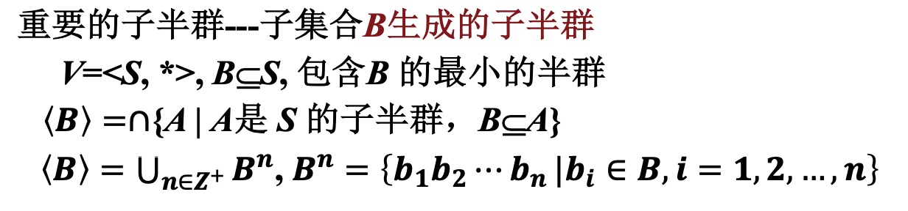
- 自由半群和自由独异点
  - 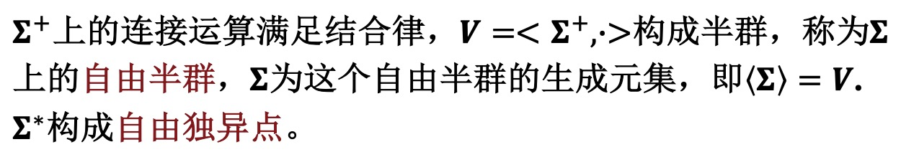
- 半群、独异点在直积、商代数、同态和同构下仍为半群、独异点
- 独异点可以用函数集合表示

### 群
- 广群、(交换)半群、(交换)独异点、群、abel群、循环群
  - 定义：
    - 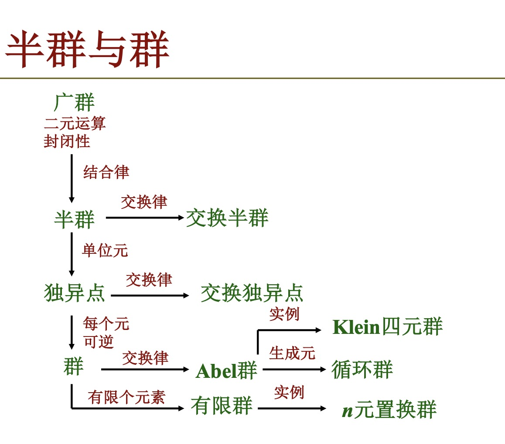
    - Klein四元群：单位元+3个其他元，他们任两个元素运算结果为另一个元，任意每个元素是自身的逆
- 群的验证
  - 非空
  - 封闭
  - 结合
  - 可逆
  - 单位元
  - 等价定义：
    - 存在右单位元+每个元素的右逆即可
- 元素a的阶|a|：使得$a^k=e$成立的最小正整数k
  - 有限群的元素都是有限阶，为群的阶的因子
- 方程$ax = b, ya = b$在群G中有解且有唯一解
- 设G是半群，若$\forall a, b\in G, ax = b, ya = b$在G中有解，则G为群
- 设G是有限半群，且不含零元. 若G中消去律成立，则G是群
- 有限群G的运算表中每行、每列都是G的置换，即aG=G, Ga=G
- 阶的重要结果
  - $|a| = 1 or 2\Leftrightarrow a = a^{-1}$
  - $|a| = |a^{-1}|, |ab| = |ba|, |a| = |bab^{-1}|$
  - $|a| = r\Rightarrow |a^t| = \frac{r}{(r, t)}$
  - $|a| = n, |b| = m, ab = ba\Rightarrow |ab||[n, m]$，若$(n, m) = 1$，则$|ab| = mn$

### 子群
- 子群H就是G的子代数，记作$H\leq G$
- $H\leq G\Leftrightarrow \forall a, b\in H, ab\in H, b^{-1}\in H$
- $H\leq G\Leftrightarrow \forall a, b\in H, ab^{-1}\in H$
- H是群G的非空**有限**子集，$H\leq G\Leftrightarrow \forall a, b\in H, ab\in H$

### 循环群
- G=\<a\>（可以有负的幂次）
- 无限循环群 / n阶循环群
- 若𝑮是无限循环群，则𝑮的生成元是a和a−1;
- 若𝑮是𝒏阶循环群，则𝑮有𝝓(𝒏)个生成元
- G=\<a\>是循环群，那么
  - (1) G的子群也是循环群.
  - (2) 若G是无限阶，则G的子群除{e}外也是无限阶.
  - (3) 若G是n阶的，则G的子群的阶是n的因子.
  - (4) 对于n的每个正因子d, 在G中有且仅有一个d阶子群.

### 变换群与置换群
- A上的一一变换群E(A)：所有A到A到双射+变换乘法构成的群
- A上的变换群：E(A)的子群
- 置换群
  - 当|A|有限时，A上的一一变换称为A上的置换。当|A| = n时称A上置换为n元置换。
  - 若将A中的k个元素𝒊𝟏, 𝒊𝟐, ... , 𝒊𝒌进行如下变换: 𝝈 𝒊𝟏 =𝒊𝟐,𝝈 𝒊𝟐 =𝒊𝟑,...,𝝈 𝒊𝒌−𝟏 =𝒊𝒌,𝝈 𝒊𝒌 =𝒊𝟏,并且保持其它元素不变，则可将记为(𝒊𝟏𝒊𝟐 ⋯ 𝒊𝒌)，称为一个k阶轮换。当k=2时，称为一个对换。
  - 设𝝈 = (𝒊𝟏𝒊𝟐 ⋯𝒊𝒌)和𝝉 = 𝒋𝟏𝒋𝟐 ⋯𝒋𝒍 是两个轮换， 若 𝒊𝟏,𝒊𝟐,⋯,𝒊𝒌 交 𝒋𝟏,𝒋𝟐,⋯,𝒋𝒍 = ∅，则称𝝈和𝝉是 不相交的。
  - 定理:若𝝈和𝝉是两个不相交的n元置换，则𝝈𝝉 = 𝝉𝝈.
  - 不交轮换的分解式:$ = \tau 1\tau 2⋯\tau t$, 其中 $\tau 1,\tau 2, ...,\tau t$为不交轮换
  - 任何n元置换都可以表成不交的轮换之积，并且表法是唯一的
  - 轮换指数：$1^{C_1(\sigma)}2^{C_2(\sigma)} ⋯ n^{C_n(\sigma)}，C_k(\sigma)$: k-轮换的个数
  - 任意轮换都可以表成对换之积
    - 对换可以有交
    - 表法不唯一，但是对换个数的奇偶性不变
      - 奇置换:表成奇数个对换之积
      - 偶置换:表成偶数个对换之积
      - 奇置换与偶置换之间存在一一对应，因此各有n!/2个
  - 令Sn为{1, 2,..., n}上所有n元置换的集合.
    - Sn关于置换乘法构成群，称为n元对称群. Sn的子群称为n元置换群.
  - 置换群中元素的阶
    - k阶轮换(i1 i2⋯ik)的阶为k 
    - 若$\sigma =\tau 1\tau 2⋯\tau l$是不交轮换的分解式，则$|\sigma|=[|\tau 1|, |\tau 2|,..., |\tau l|]$
  - 置换群的实例
    - 每个群G都与一个变换群同构
    - 推论：每个有限群都与一个置换群同构.

### 群的分解
- 陪集
  - G为群，$H\leq G, a\in G$,称$Ha = {ha | h\in H}$是子群H在G中的一个右陪集
  - $Ha$中的a称为该陪集的代表元素。
  - G为群，H 是 G 的子群，则
    - $|Ha| = |H|, a\in Hb\Leftrightarrow Ha = Hb\Leftrightarrow ab^{-1}\in H$
    -  在G上定义二元关系R, $aRb\Leftrightarrow ab^{-1}\in H$，则R为等价关系，且$[a]_R = Ha$
    -  $a, b\in G, Ha\bigcap Hb = \empty \lor Ha = Hb, \bigcup Ha = G$
  - Lagrange定理的引理
    - H 的左陪集和右陪集个数相等
    - H 在 G 中的指数$[G : H]$定义为H 在G中的右（或者左）陪集个数
  - Lagrange定理及其推论
    - G是**有限**群，H≤G, 则$|G| = |H|[G : H]$
    - 推论
      - 有限群中，元素的阶是群的阶的因子
      - 素数阶群一定是循环群
  - 6阶群不是循环群就同构于$S_3$
- 共轭关系与共轭类
  - 设G为群，定义G上二元关系R，$aRb\Leftrightarrow \exist x\in G$使得 $b = x^{-1}ax$，称R为G上的共轭关系
  - 共轭关系是G上等价关系，等价类为共轭类ā
    - $|\bar a| = [G:N(a)], N(a) = \{x\in G | xa = ax\}$
    - $a\in C\Leftrightarrow \bar a = \{a\}$(C是中心)
  - 群的分类方程
    - G为有限群，C为中心，G中至少含两个元素的共轭类有k个，a1, a2, ..., ak为代表元素，则$|G| = |C| + \sigma[G:N(a_i)]$
    - 中心：
      - 中心化子：和任意元素可交换的元素
      - 中心：所有中心化子构成的集合
      - 群的中心是交换群

### 正规子群与商群
- 正规子群 (Normal subgroup) ：设G是群，$N\leq G$, 且$\forall g\in G, gN = Ng$，则称N是G的正规子群，记为N⊴G.
- 判定定理：$N\leq G$
  - $N\unlhd G\Leftrightarrow \forall g\in G, gNg^{-1} = N\Leftrightarrow \forall g\in G, \forall n\in N, gng^{-1}\in N$
- 正规子群及其判定
  - $N\unlhd G, H\unlhd G\Rightarrow N\bigcap H\unlhd G$
    - 子群的交集仍为子群
- 正规子群的判定
  - (1) 判定定理
  - (2) |N|=n, N是G的唯一n阶子群
  - (3) 指数为2的子群
- 商群
  - G是群，N⊴G , 定义：G/N = $\{Na|a\in G\}$，(Na)(Nb)=Nab
- (1)若H是G的子群且$N\subseteq H$,则N是H的正规子群,H/N是G/N的子群.
- (2)若L是G/N的子群,则存在G的子群H,使得$N\subseteq H$且L = H/N.
- |G/H|=[G:H]，商群的阶是|G|的因子保持群G的性质：交换性，循环性等
- G为Abel群，|G|=n, 素数p整除n, 则G中有p阶元
  - 归纳法，对于小于n的成立则对于n也成立
  - $\exist\ a,$p | |a|则$a^{|a|/p}$即为所求
  - 否则，$|G/<a>|$有p阶元Hb，倒关系得$b^{|a|}$为p阶元
- 设p, q为互异素数，则pq阶Abel群必为循环群

### 群的同态与同构
- 对于群，同态保单位元和逆元
- 𝒇 𝒆𝟏 = 𝒆𝟐, 𝒇(𝒙−𝟏) = 𝒇 (𝒙) −𝟏 ，满同态𝒇将生成元映到生成元 |𝒇(𝒂)|整除|𝒂|，同构条件下|𝒇(𝒂)| = |𝒂|
- H$\leq$G1=>f(H)$\leq$G2, H$\unlhd$G,f为满同态，f(H)$\unlhd$G2
- 同态核
  - $kerf = \{x\in G | f(x) = e_2\}$
    - 𝐤𝐞𝐫𝒇 = {𝒆𝟏} ⇔ 𝒇为单同态
    - 𝐤𝐞𝐫𝒇 ⊴ 𝑮𝟏,∀𝒂,𝒃 ∈ 𝑮𝟏,𝒇(𝒂) = 𝒇(𝒃) ⇔ 𝒂𝐤𝐞𝐫𝒇 = 𝒃𝐤𝐞𝐫𝒇
- 同态基本定理
  - (1) 𝑵为𝑮的正规子群，则𝑮/𝑵是𝑮的同态像 
    - 同态映射𝝉称为𝑮到𝑮/𝑵的自然同态
      - 𝝉:𝑮→𝑮Τ𝑵,𝝉 𝒂 =𝒂𝑵, ∀𝒂∈𝑮
  - (2)若𝑮′为𝑮的同态像𝒇𝑮 =𝑮′，则𝑮/𝐤𝐞𝐫𝒇≅𝑮′.
  - 定理2表明，商群总是群的同态像
    - 定理3表明，群的同态像一定与某个商群同构
    - 因此同态基本定理表明，在同构意义下，群的同态像就是它的商群
    - 因而确定群的全部同态像等价于找出该群的全部正规子群
  - 推论：设𝑮与𝑮是两个有限群，若存在满同态𝝋: 𝑮 → $\bar G$，则$|\bar G| | |𝑮|$
  - 循环群的同态像还是循环群
    - 推论 循环群的商群也是循环群。
    - 故循环群的子群、同态像、商群皆为循环群
  - 设𝝋: 𝑮 → 𝑮是群𝑮到群𝑮的满同态，𝐤𝐞𝐫𝝋 = 𝑲，则𝑮的包含𝑲的子群$\bar 𝑮$的所有子群之间可以建立一个保持包含关系的双射。即，令$𝑴= \{𝑯 | 𝑯≤𝑮,𝑯⊇𝑲\}$ , $\bar 𝑴={\bar 𝑯|\bar 𝑯≤\bar 𝑮}$,则𝑴与$\bar 𝑴$之间可以建立一个保持包含关系的双射。
    - 把定理5中的子群改 为正规子群，结论仍然成立
- 群的第一同构定理
  - 同态基本定理
    - 设$\phi$是群G到群$\bar G$的一个同态满射，则$G/ker\phi \cong \bar G$
  - 将同态基本定理推广就得到下面的第一同构定理。
  - 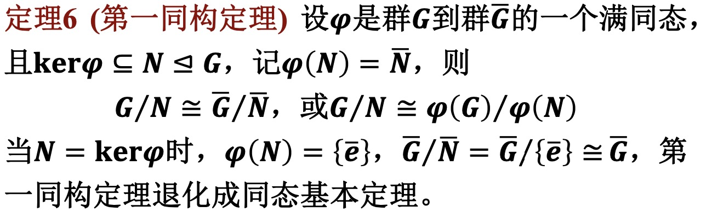
  - 剩余的同构定理看课件吧
- 自同态与自同构
  - (内自同构)
  - 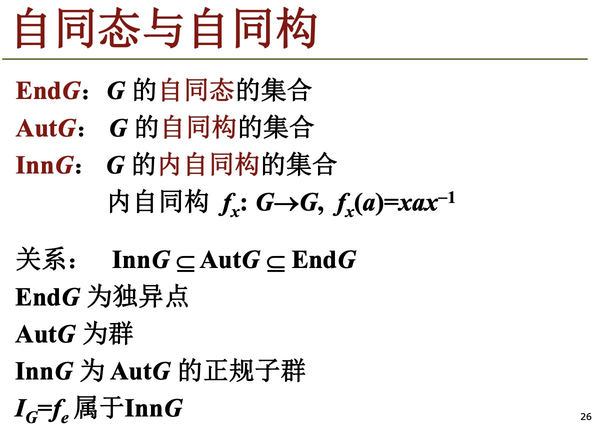

### 环
- 定义
  - +，*两个运算
  - 关于+构成交换群
    - 单位元0
    - 逆元-x
  - 关于*构成半群
    - 单位元(如果存在)记作1
    - 逆元(如果存在)$x^{-1}$
    - 未必可以交换
    - $(x+y)^2 = x^2 + xy + yx + y^2$
  - *关于+满足分配律
    - +的单位元0恰好是乘法的零元
- 特殊的环
  - 交换环、含幺环：关于乘法
  - 无零因子环：$ab=0\Rightarrow a=0\lor b=0$
    - 实例：数环, Zp为无零因子环当且仅当 p为素数.
    - 定理：R是环，R为无零因子环 $\Leftrightarrow$R中乘法有消去律.
  - 整环：无零因子、含幺、交换环
  - 除环：|R|>1, \<R*,×\> 构成群(R*中每个元素都可逆)
  - 域：|R|>1, 交换的除环或者R*中每个元素都有逆元的整环
- 设p为素数，证明Zp是域。
- 消去律和无零因子充要
- p, q为不等的素数，证明无pq阶的整环
  - pq阶整环关于加法必然循环，可以表示出所有数，可以找出零因子
- 有限域
  - F为域，|F|有限
  - 结论：有限的整环都是域
  - 有限域的特征
    - F为有限域，1在<F, +>中的阶为域F的特征.例如，Zp的特征为p.
    - 有限域的特征为素数. 
  - 域上的多项式环
    - 设f 是群G的满自同态，若G只有有限个子群，证明 f 是G的自同构。一般地，群的自同态满射不一定是自同构
      - 一般情况的反例是多项式的求导
  - 设F为有限域，则存在素数p使得|F|=$p^n$
    - $A=<1>=\{0, 1, ..., p-1\}\Rightarrow F=Ax_1+Ax_2+...+Ax_n$

### 子环、理想、商环、环同态
- 子环
  - 定义：非空子集关于环中运算+, × 构成环
  - 实例：nZ是\<Z, +, ×\>的子环
  - 判别：子加群判别+半群判别
  - 子环判定定理
    - 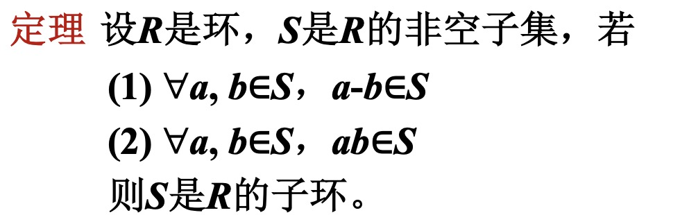
- 理想
  - D是环\<R, +, ×\>的非空子集，满足
    - (1) \<D, +\> 是\<R, +\>的子群
    - (2) $\forall r\in R, rD\subseteq D, Dr\subseteq D$
  - F[x]为数域F上的多项式环
    - 常数项为0的子集构成$F[x]$的理想
    - 左理想：$\forall r\in R, rD\subseteq D$
    - 理想是R的子环，但是子环不一定是理想
    - 平凡理想：\{0\}, R自身。
- 商环
  - 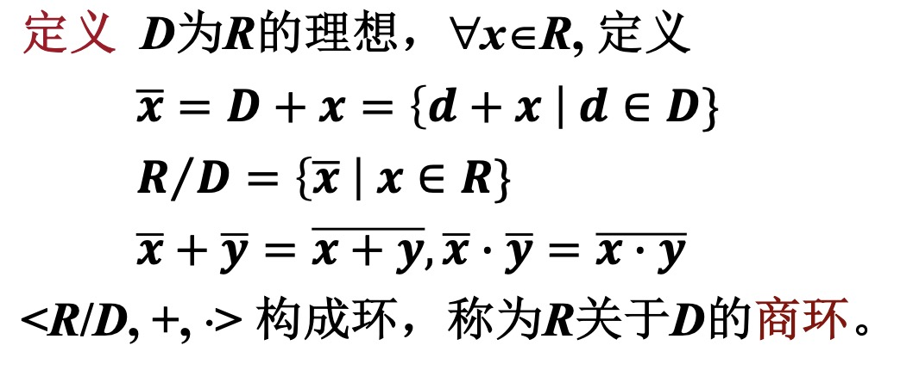
- 环同态
  - 保加、乘
  - 同态核：映射到0的元素
  - 性质
    - 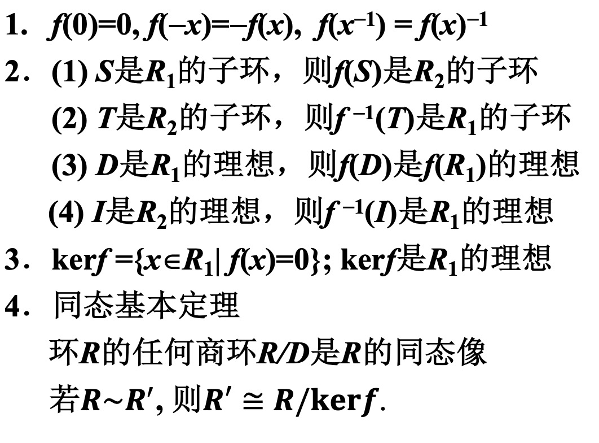
    - $f(D)$是$f(R_1)$的理想，不一定是$R_2$的理想

### 格
- 定义
  - <S, ≼>, S的任何二元子集都有最大下界、最小上界.求最大下界、最小上界构成格中的运算$\wedge \vee$
  - 对偶原理
    - 对偶命题
      - 设P是由格中元素, ≼, ≽, =, $\wedge, \vee$等表示的 命题，将P中的≼, ≽, $\wedge, \vee$分别替换成≽, ≼, $\vee, \wedge$得到 的命题称为P的对偶命题，记作P*
    - 对偶原理:如果 P 对于一切格为真，则P*也对一切 格为真
  - 偏序关系是满足自反性、反对称性、传递性的性质
  - 上下界满足交换律、结合律、幂等律、吸收律
  - 交换、结合、吸收律 -> 幂等律
  - 等价定义:设<L, $\wedge, \vee$>是具有两个二元运算的代数 系统，如果$\wedge, \vee$满足交换、结合、吸收律，则称<L, $\wedge, \vee$>是格
  - 格的不等式
    - 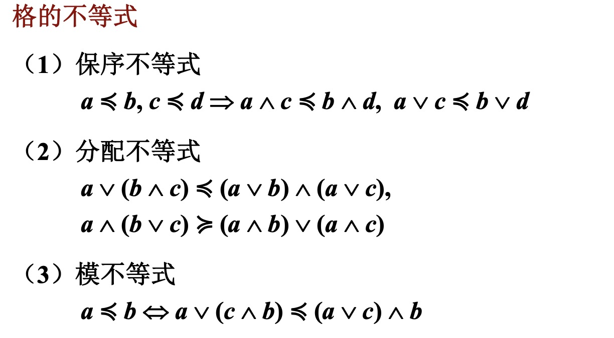

### 子格、格同态
- 子格：关于$\lor, \land$封闭
- 格同态：$a\leq b\Rightarrow f(a)\leq f(b)$
  - $f(a)\leq f(b)$不一定能推出$a\leq b$
- 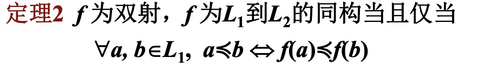
- 完备格
  - 设L是格，若对L的任何子集S，S的最大下界 $\land S$, 最小上界$\lor S$均存在，称L是完备格.
  - 空集的最大下界为最大元，最小上界为最小元
  - 有限格、幂集格均为完备格
- 有补格：任意元素a，$\exists b, a\land b = 0, a\lor b = 1$
- 布尔代数
  - 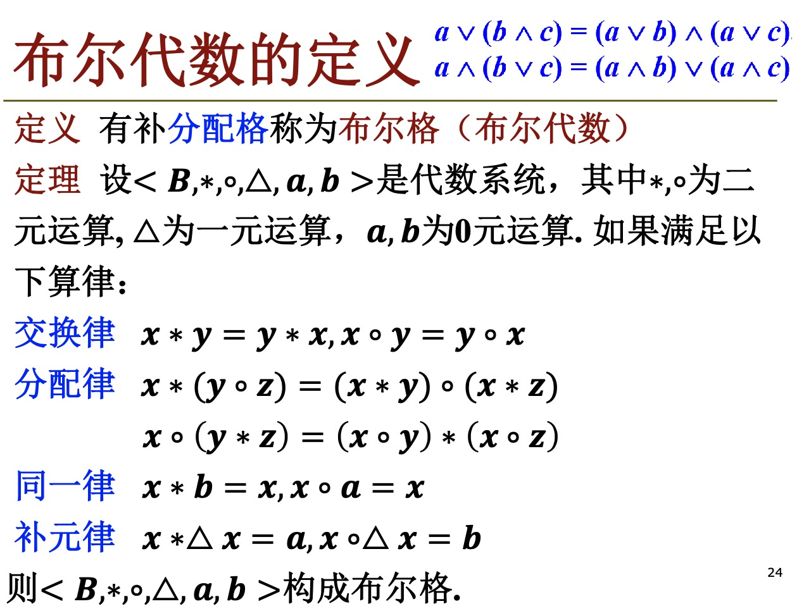
  - 任何有限布尔代数元素数为$2^n$.
  - 任何有限布尔代数都同构于$\{0, 1\}^n$

### 一些定义
- Klein四元群：平方得e，非e元素相乘得另一元素的群
- 对称群
  - 令Sn为{1, 2,..., n}上所有n元置换的集合.
    - Sn关于置换乘法构成群，称为n元对称群. Sn的子群称为n元置换群.

### 一些小结论
- 子群的交集仍为子群
- G是群，$\forall a\in G, a^2 = e\Rightarrow$ G为Abel群
- $A_n$：偶交换群
- $S_n$：置换群
- $|a| = n, |b| = m, ab=ba\Rightarrow |ab| | [n, m],\ if\ (n, m) = 1, |ab|=nm$
- 设G是有限半群,且不含零元.若G中消去律成立,则G是群.
- G为Abel群，|G| = n, 素数p|n, 则G中有p阶元.
  - 推论 pq (p, q为互异素数) 阶Abel群必为循环群。