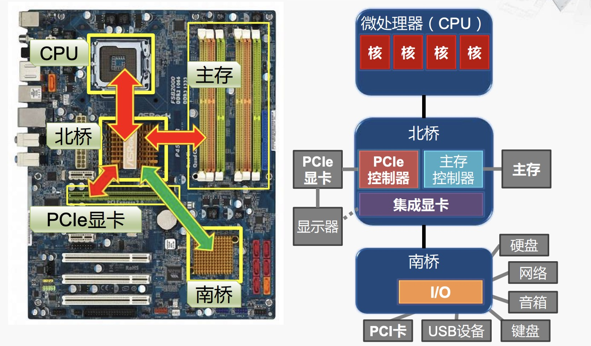
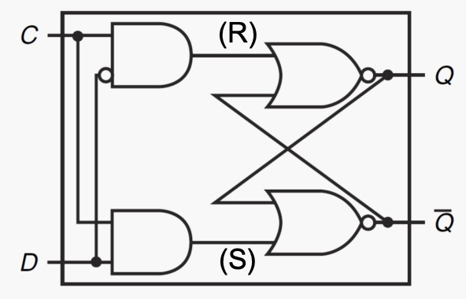

### 计算机基本结构
- 电子计算机的兴起
  - ENIAC：世界上第一台**通用**电子计算机
  - ENIAC的开关定位和转插线只不过代表着一些数字信息，完全可以像受程序管理的数据一样，存放于主存储器中。（“存储程序”的概念） 
  - 《关于EDVAC的报告草案》 -> 冯诺依曼结构
  - EDVAC的主要特点：
    - 实现“存储程序”概念，大幅提升了任务效率 -> 存储程序式计算机
    - 指令和数据采用二进制，极大简化了逻辑
    - 线路由五个基本部分组成
      - 运算器，控制器，存储器
      - 输入设备，输出设备
- 冯诺依曼结构的要点
  - EDVAC两个重要思想
    - 使用存储程序，而非开关总线
    - 使用二进制，而非十进制
    - 计算机的五个部分
      - 运算器，控制器，存储器
      - 输入设备，输出设备
      - CPU
        - 运算器 CA
        - 控制器 CC
      - 主存储器
        - 存储器 M
          - 是cpu可以直接控制的，硬盘不是存储器
      - 输入设备 I
      - 输出设备 O
  - 冯诺依曼结构的要点
    - ①计算机应由运算器、控制器、存储器、输入设备和输出设备共5个部分组成
    - ②**数据和程序**均以**二进制代码**形式不加区别地存放在存储器中,存放位置由存储器的地址指定（存储程序）
    - ③计算机在工作时能够自动地从存储器中取出指令加以执行（存储程序）
  - CPU - 系统总线 - 主存储器
  - 主存的组织形式
    - 地址-内容
    - 主存中包含指令和数据（第2条）
      - 如果不放指令，由于发放指令过慢导致效率很低
  - 
- **刚启动时发生了什么**
  - 系统启动-从BIOS芯片取第一条指令，跳转到BIOS另一条指令，简单地配置主存-将BIOS指令搬到主存中（BIOS太慢了且不能写，保证地址是一样的，北桥芯片特殊设计，读发送到BIOS，写发送到主存）-设北桥到寄存器，掐断北桥读“发送到BIOS”-执行BIOS程序，配置...-从硬盘搬运操作系统
  - bios严格算外部的存储系统
- x86体系结构
  - Intel 8086
    - 16位
      - 内部的通用寄存器是16位
      - 正常情况下x位cpu能发x位地址，但16位 / 64位不是这样的
        - 16位希望完成20个地址总线的访存
        - 物理地址的形成采用“段加偏移”的方式
  - Intel 20286
    - 希望访问24位
    - 引入了“保护模式”，但是机制有缺陷
      - 例如，每个段仍为64KB，严重限制软件规模
    - 实模式
      - 8086只有一块内存供以使用
      - 286支持上述模式，称为实模式
  - Intel 80386（IA-32的开始）
    - 80x86系列中的第一款32位微处理器
    - 地址总线扩展到32位，可寻址4GB的内存空间
    - 改进了“保护模式”（例如，段范围可达4GB）
    - 增加了“虚拟8086模式”
    - 可以同时模拟多个8086微处理器
  - x86-64运行模式
    - 传统模式：32位，以前的程序不需要重新编译
    - 长模式：
      - 纯64位模式，原程序需要重新编译
      - 兼容模式，内存变大了，不需要重新编译已有程序
  - 物理地址生成
    - IP寄存器，指令指针寄存器+段寄存器配合产生20位地址
    - 逻辑地址：【段基址，偏移量】；段基址16位左移4位+偏移量=物理地址
      - 直观的，只用4位段号的问题
        - 段号寄存器与其他寄存器不兼容，操作麻烦
        - 每个逻辑段固定占用64K字节，会浪费存储空间
    - CS寄存器会由系统自己取，没有变成32位
    - DS等其他寄存器地址需要汇编程序写进去
  - 如果数据存放在数据段以外的其它段（例如附加段），则应在指令中给出“段跨越前缀”
    - MOV AX, ES:[3000H]
    - ES: MOV AX, [3000H]
  - SS堆栈段寄存器，SP堆栈指针寄存器在完整的汇编程序中需要自己写，以防冲突
  - IA32为了兼容，依然保留着段+偏移
    - 保护模式下，CS:EIP
    - gdtr+cs+检查权限、界限得到基地址
    - 64位全局描述符表基地址全0，页表控制划分
- 冯诺依曼结构如何运转
  - 计算机执行一条指令的主要步骤。
    - 第一步：取指（Fetch）。
    - 第二步:译码（Decode）。
    - 第三步:执行(Execute)。
    - 第四步:回写( Write-back)
- 计算机结构的简化模型
  - 模型机
    - CPU -系统总线- 存储器
    - 系统总线
      - 控制总线
      - 地址总线
      - 数据总线
    - 存储器
      - 地址编制方式，CPU通过地址总线控制
      - 如果地址总线宽度为n,则CPU能管理的存储单元最多为2^n个
      - CPU发来的地址存放在MAR(Memory Address Register)
      - 读写的数据通过数据总线传送
      - 数据总线的宽度一般为存储单元位宽的整数倍
      - CPU正在读区或即将写入存储单元的数据放在MDR(Memory Data Register)中
      - 控制总线与存储器中的控制逻辑相连，用于接受 / 反馈读写（已完成）信号
    - CPU
      - 控制器
        - 指令寄存器IR：正在执行或即将执行的指令
        - 程序计数器PC：PC存放“下一条指令的存储单元地址”，具有自动增量计数的功能
        - 存储器地址寄存器 MAR在访存时用于存放“存储单元的地址”
        - 存储器数据寄存器 MDR在访存时用于存放“对存储单元读/写的数据”
        - 指令译码部件对IR中的指令进行译码，以确定IR中存放的是哪一条指令
        - 控制电路产生控制信号，在时序脉冲的同步下控制各个部件的动作
      - 运算器
        - 算数运算
        - 逻辑运算
          - 与或非
        - 核心部件ALU完成算数运算和逻辑运算
        - ALU对X、Y中的数据进行运算，将结果送到Z。X、Y、Z作为ALU的数据暂存器，可视为ALU的一部分
        - F用于存放运算结果的状态 （零/正负/进位/溢出）
        - 通用寄存器，用于临时存放数据。数据可能来自存储器，也可能来自其它通用寄存器或ALU的输出
        - 内部总线用于在CPU内部各个部件之间传递数据
- 计算机执行指令的过程
  - 取指
    - ①控制器将指令的地址送往存储器
    - ②存储器按给定的地址读出指令内容，送回控制器
  - 译码
    - 控制器分析指令的操作性质控制器
    - 向有关部件发出指令所需的控制信号
  - 执行
    - 控制器从通用寄存器或存储器取出操作数
    - 控制器命令运算器对操作数进行指令规定的运算
- 计算机输入和输出
  - 外部记录介质R，不会因为掉电而失去数据
  - 模型机类似存储器的两个单元，两个单元拥有不同地址，和存储器的地址不同
  - 控制总线、地址总线、数据总线连接输入输出和存储器两部分
- 冯诺依曼结构和具体实现
  - CPU - CA CC
  - 主存 - M
  - CPU-北桥芯片-主存
  - 南桥 - I/O
  - 硬盘 - R
  - 第一条指令：BIOS芯片，与南桥相连，只读存储器，R
  - 读取第一条指令 -> 检查各个设备（显卡等）
  - 显卡中有GPU，有时候承担运算功能，也有 CA CC 功能
  - 南北桥构架的演变
    - 
    - 优化CPU - 主存的连接
    - 
    - 优化CPU-PCIe显卡-显示器的连接，北桥剩余部分整合到南桥
    - 
    - 进一步缩减：系统芯片，得益于摩尔定律
      - 将计算机或其他电子系统集成为单一芯片的集成电路
      - 在智能手机、平板电脑等移动计算设备上得到广泛应用
  - 摩尔定律
    - 当价格不变时，集成电路上可容纳的晶体管数目，约每隔18个月便会增加一倍，性能也将提升一倍

### 指令系统体系结构
- 设计自己的计算机
  - 一个简单的计算指令系统
    - 运算类指令
      - ADD R, M
    - 传送类指令
      - LOAD R, M
      - STORE M, R
    - 转移类指令
      - JMP L
  - 指令的格式
    - 每指令2字节
    - 操作码：第一个字节高4位
    - 寄存器：第一个字节低4位
    - 存储单元地址：第二个字节
  - 汇编代码的格式
    - 手工分开段
      - DATA SEGMENT
        - NUM DW(DATA WORD, 16位) / DB / DD
        - 声明可以逗号好几个，类似数组
      - DATA ENDS
      - 堆栈段复制就行
        - TOP栈长
      - 代码段
        - CS: CODE, DS: DATA, SS: STACK
          - 告诉汇编器这一段是代码，这一段是数据段...
          - 本质上汇编器只会把CODE配好，之后需要手工配
            - 不允许把立即数直接放入段寄存器
        - BEGIN：真正开始
        - OFFSET：只有偏移地址
        - INT 21H：基本的库函数放在BIOS里，通过中断调用制定程序，参数传到寄存器中
        - CODE ENDS
          - END BEGIN
      - 可以加附加段
    - 指令
    - 伪指令：会被拆分成多条指令
      - EQU 常量定义
      - 格式：ORG 常数表达式
        - 作用：指定当前可用的存储单元的偏移地址为常数表达式的值
      - 格式：EVEN
        - 作用：将当前可用的存储单元的偏移地址调整为最近的偶数值
      - 格式：过程名 PROC 类型属性名
        - 说明：从“过程名”代表的地址开始定义一个过程；“类型属性名”可选择NEAR（近过程）或FAR（远过程），默认为NEAR
        - 最后需要写ENDP
    - 宏指令：类似函数

### CISC和x86指令
- CISC是系统性的规定，包括cpu该怎么设计等
- 手机 / 平板电脑一般是ARM，比较复杂的RISC
- CISC 和 RISC
  - CISC：需要什么功能就给什么功能，发展出现CPU过于复杂响应过慢（有精简内存少放程序的思路，在内存受限的地方）
  - RISC：只使用支持功能的基本功能，CPU变得很简单、便宜且快，程序员的开发代价变高，由比较好的编译器解决
  - 精简到多少是好？
    - 理论上，一条就够——布尔代数，真假+与或非（可以转成与非 / 或非）
      - 程序变得非常庞大，运行速度减慢
    - 需要尝试、权衡
  - 目的：快
- 体系结构 和 微体系结构
  - architecture / microarchitecture
  - 体系结构规定指令，不同体系结构指令不同
  - 微体系结构差别：流水线层级不一样 / 自行车车轮大小不一样，性能不同，但是指令是不变的
- x86指令(CISC)
  - LOCK：避免指令被打断
  - 运算类
    - 操作数有限制，譬如不能两个存储器
    - ADD DST, SRC
    - ADC DST, SRC：带进位的加
    - INC：单列出来了INC一个寄存器的命令，也有INC一个带偏移的普遍指令——CISC的设计理念
    - DAA：加法十进制调整指令
  - 传送类
    - 操作数有限制，譬如不能两个存储器
    - MOV DST, SRC
    - XCHG OPR1, OPR2：交换两个变量的位置，可以不被中断
    - XLAT：查表
  - 转移类
    - 条件 / 无条件
    - 直接转移 / 间接转移（JMP BX）
  - x86指令的发展
    - SSE：扩展的一套面向游戏的指令
  - 注意
    - 操作符一样，编码可能不同
    - 相同的指令，有可能会划分特例
    - 某功能会添加指令完成
- MIPS指令(RISC)
  - 历史
    - 占据移动计算领域市场
    - 超级计算领域逐渐被CISC打败
    - 个人计算领域(手机)ARM、RISC占据市场设备数量超过CISC
      - 智能手机逐渐上升
      - 个人计算机波动且缓慢下减->厉害地下跌->跌到缓和
    - 新能源汽车
      - “大计算机”，一样结构的芯片和主板
      - 新的领域仍在争抢
      - 销售额暴涨
  - 主要特点
    - MIPS：没有互锁的流水级
      - 流水线锁死：需要等之前条件计算完
      - MIPS希望流水线不会被锁死，饱满地运行
    - 主要关注点
      - 减少指令等类型
      - 降低指令等复杂度
    - 基本原则
      - A simpler CPU is a faster CPU.
    - 历史背景
      - 已经有复杂度流水线
        - 只执行一条指令意义不大
      - 有很强的编译器编译RISC, CISC区别不大
  - 指令
    - 装载
      - 格式:lw $8,($19)
      - 操作:以19号寄存器的内容为地址，取出存储器中的32位(MIPS word)数据，存入8号寄存器
    - 加法
      - 格式:add $10,$9,$8
      - 操作:将8号和9号寄存器的内容相加，结果存入10号寄存器中
    - 存储
      - 格式:sw $10,32($19)
      - 操作:将10号寄存器的内容存入存储器，地址为19号寄存器的内容加32
    - x86的mov编码不同，所以分开装载、存储并没有比x86复杂
  - 通用寄存器
    - 32个(32位宽)
    - 零号寄存器：使判断正负等可以用寄存器相关语句，简化命令
    - 写程序通常使用t，s临时寄存器，两者的区别是谁负责保证寄存器不被改变
  - 主要特点
    - 固定的指令长度(32-bit，即1 word)
      - 简化了从存储器取指令
      - x86需要取出来判断多长(一般取很多放到缓冲区，不断取)
      - 整数指令平均长度高于x86
    - 只有Load和Store指令可以访问存储器
      - 所有操作都在cpu里面
      - 指令数增多
      - 好处是，少了每条指令都消去了访存操作，电路结构很简单
    - 简单的寻址模式
      - x86中括号里可以各种运算地址
        - 简单易懂，便于操作
      - MIPS只支持偏移量
        - 很难手工写和修改，由编译器弥补
    - 指令数量少，指令功能简单
      - 一条指令只完成一个操作，简化指令的执行过程
      - 每条指令运行时间相似，可以快速动起来
      - 影响
        - 处理器设计简单
        - 处理器运行速度快 
        - 编程复杂
        - 程序代码量大
        - 需要优秀的编译器
  - 基本格式(一种格式对应一种电路)
    - R型指令
    - I型指令
    - J型指令(无条件转移，特殊转移需要由上面两种解决)
  - 按功能划分指令
    - 运算指令
    - 访存指令
    - 分支指令
  - R型指令
    - 格式
      - 6个位域
        - opcode(6)：制定类型
          - R型全是0
        - rs、rt、rd、shamt(5)
          - rs：source Register
            - 通常用于指定第一个源操作数所在的寄存器编号
            - 5bit：决定用32个寄存器(ARM选择了4个bit，更丰富的功能占掉了一些bit，受到了很大的限制，因而5bit比较合适)
              - x86是堆栈型，设计之初内存和cpu速度类似，因而传参在内存里，因而只有8个寄存器且有一堆访存操作，速度拉开后也加了很多寄存器
          - rt：Target Register
            - 通常用于指定第二个源操作数所在的寄存器编号
            - 别的指令还需要把该位域作目标
          - rd：Destination Register
            - 通常用于指定目的操作数(保存运算结果)的寄存器编号
            - x86寄存器比较少，因而覆盖掉了一个
          - RISC在格式确定后寄存器数量此后不能再改了
          - shamt：shift amount
            - 空了5个bit，因而可以切5个bit完成常用操作
        - funct(6)：与opcode域组合，精确地 指定指令的类型
        - `add $8,$9,$10 # R[rd]=R[rs]+R[rt]`
        - `sll $8,$9,10 # R[rd]=R[rt]<<shamt`
      - 为什么这么设计？
        - 设计完发现只需要4个5bit，剩余6bit可以为别人节省空间，把类别定位第0位
  - I型指令
    - 有一些指令不太合适用R型，需要扩展
      - R型指令加立即数只能用5个bit，权衡之后不舍得抛弃funct位
      - 常用的立即数远大于这个范围，因此需要新的指令格式
    - 格式
      - 动机
        - 操作数只需要两个寄存器
        - 剩余的opcode够用了，而10位立即数能力太弱了
      - opcode(6) + rs(5) + rt(5) + immediate(16)
      - 目的操作数改为rt(个别操作为第二个源操作数)，这样需要不同的电路来做
        - 但是立即数拼到了一块，立即数使用更方便了
      - immediate
        - 16-bit的立即数，可以表示216个不同数值
        - 对于访存指令，如lw rt,imm(rs) 通常可以满足访存地址偏移量的需求(-32768~+32767)
        - 对于运算指令，如addi(i: 立即数操作) rt,rs,imm 无法满足全部需求，但大多数时候可以满足需求(32位不能再切了，opcode不能再让(保证类型译码正常运行))
          - 加32位有时通过多次加完成
      - `addi $21,$22,-50 # $21=$22+(-50)`
      - `lw $21,-50($22) # $21=Mem[$22+(-50)]`
      - `slti $21,$22,-50 # $21=($22<(-50))?1:0`
        - x86通过更改标志位完成，MIPS没有标志寄存器，比较结果放到指定寄存器中
  - MIPS分支指令
    - 并不是所有分支指令都是J型实现的
    - “分支指令”：b打头branch
    - x86无条件跳转/条件跳转
    - MIPS从图的角度看所以称为分支，无条件跳转不是分支所以用j，条件跳转是b
      - 非条件分支只有j指令(r型里还有jr)
      - 条件分支两个：beq，bne
      - x86条件转移很多，根据条件位 / 符号
    - I型分支指令
      - beq reg1,reg2,L1
        - if (value in reg1)==(value in reg2) goto L1
      - 如何判断小于？
        - slt $t0,$s0,$s1 \# $t0 = 1, if g<h
          - set less than
          - 不使用标志位的，bne，跟0号寄存器比较(使得bne只用有比较两个寄存器这一种类型，节省指令数)
          - 为精简指令，又不希望所有比较都有对应的类似slt的指令，因而需要指令的组合完成之
      - 如何充分发挥16-bit的作用？
        - 以当前PC(x86为IP)为基准，16-bit可以表示±$2^{15}$ bytes
        - MIPS的指令长度固定为32-bit(word)，只有32bit对齐的地方才有指令
        - 16-bit位移量指示word可以表示 ±$2^{15}$ words = ±$2^{17}$ bytes(±128KB)
      - 目标地址计算方法
        - 分支条件不成立，PC = PC + 4 = next instruction
          - 不用推断指令长度，比x86简单很多
        - 分支条件成立，PC = (PC+4) + (immediate*4)
          - 为什么要先+4？
            - 取完指令后并不知道现在是什么，opcode是什么，译码+比较后才知道下一个位置(需要好几拍)。大部分情况下是直接+4，为硬件简单，先+4即不用额外更改逻辑
    - 非条件(J型)分支指令
      - 在不需要条件判断的情况下，如何扩大目标地址范围
        - 理想情况，直接使用32-bit地址
        - 冲突:MIPS的指令长度固定为32-bit，opcode占用了6-bit
        - 目标地址的计算方法
          - New PC =\{(PC+4)[31..28], address, 00\}
          - 大的数字加减会给运算器造成负担，拼接更硬件友好
          - 整个内存分成了16份，每份中都可以跳转
      - x86 追求指令密度，提供了不同的转移指令：短转移(8位位移量)、近转移(16位位移量)、远转移(CS(偏移地址)和IP(段基址)给出绝对的地址)
        - 带符号位移量
        - 80386开始可以使用32位近转移
        - 短转移计算：目标地址-(JMP指令地址+2，即IP寄存器的值)
    - 非条件分支指令(R型)
      - J型指令的目标地址范围:$2^{28}$bytes(256MB)
        - 相对于当前PC的最远距离为±$2^{28}$bytes(±256MB)——为什么?
          - 这里是理论上可以达到的最远跳转，在一个段里最上面可以跳到最下面
      - 如何到达更远的目标地址?
        - (1)2次调用j指令;
        - (2)使用jr指令:jr rs
          - I型指令也可以
          - 能否把一个32位数move到一个寄存器里？
            - 不能直接做到，移位 / 加法做出32位
      - 对比x86
        - 格式:JMP DWORD PTR OPR
        - 操作
          - 1 寻址到OPR指定的存储器单元双字 
          - 2 将该双字中的低字送到IP寄存器中 
          - 3 将该双字中的高字送到CS寄存器中
- 汇编器提供的伪指令
  - 寄存器传送
    - 格式:move dst,src
    - 实际:addi dst,src,0
  - 装载地址:Load Address (la)
    - 格式:la dst,label
  - 装载32位立即数:Load Immediate (li)
    - 格式:li dst,imm
- MIPS实现串很复杂
  - (对比x86)串操作指令的列表
    - MOVSB
      - 将地址DS:SI所指向的存储器字节单元传送到地 址ES:DI;修改SI和DI的内容，指向串的下一元素
      - S-source, D-dst
      - MOVSB还可以设置方向标志DF，决定SI、DI向前还是向后动
        - 目的是为了防止源串和目的串重合的情况
        - CLD：清出DF
    - REP
      - 把之后的指令循环CX次
      - 这个不会去指令
      - REP MOVSB
      - 对比写循环
        - 指令数变多
        - REP更快，不需要move，取指令，比较是否到限度，跳转
      - REP MOVSB
        - 隐含5+个操作数
    - MOVSW
      - 传两个字节
    - REPNE和REPNZ(不相等/不为零重复)
      - 当ZF=0且CX≠0时，重复执行
      - 适用:CMPS(串比较)，SCAS(串扫描)
    - SCASB指令 / SCASW指令(字节/字串扫描)
      - 操作:
        - 比较“AL/AX的内容”和“目的串当前字节/字”
        - 修改DI而不修改SI
        - 不回写结果，只影响标志位
      - 说明:
        - 使用重复前缀REPE / REPZ或REPNE / REPNZ
        - 寻找“目的串”中第一个与AL/AX的值相同或不相同的元素
- ARM指令格式
  - 设置了4-bit的条件码导致占用了太多指令空间，不能给3个5-bit寄存器编号指定空间，因而只有16个寄存器
  - 加法配不同的条件码可以得到不同的指令
- RISC-V
  - 相较MIPS更工整

### 算数逻辑单元
- 慕课笔记
  - 算数运算和逻辑运算
    - add：可能产出溢出异常，addu不会
    - ir-指令译码-控制电路将寄存器 / ir中的立即数 / alu的输出通过内部总线传送
    - 16位+32位需要转化
      - MIPS addi（I型add）：扩展16位，新32位的高16位都与原16位的最高位相同（符号扩展）
    - 逻辑运算
      - and / or / nor或非
      - andi / ori（0扩展）
    - 总体需求  
      - 算数运算
        - 32位数加减
        - 检查是否溢出
      - 逻辑运算
        - 32位数的与、或、或非
  - 门电路的基本原理
    - 通常使用MOS晶体管（金属-氧化物-半导体）
      - N型MOS管
        - 源：高电位时，电流导通
        - 漏：电流流向
        - 源：电流来源
      - PMOS
        - 源低电位导通
      - CMOS
        - 上述电路构成的互补型逻辑电路
    - 非门
      - A-PMOS(电源)+NMOS(地)-Y
    - 与门(·)
      - 与非门实现：
        - 比与门更简单
        - A、B都是：-PMOS(电源)-NMOS(地)
        - PMOS并联，NMOS串联
    - 或门(+)
    - 异或门($\bigoplus$ 或 ^)
  - 寄存器的基本原理
    - D触发器
      - 具有存储信息能力的基本单元
      - 由若干逻辑门构成，有多种实现方式
      - 接口
        - input / output / clock
        - 时钟上沿input到output，其他时间不变
          - 在CLK-to-Q的时间内输出到output
        - 按快门前后，待拍摄的画面不能有变化 →Setup/Hold时间
  - 逻辑运算的实现
    - 与门和与运算指令
      - 把32个与门并排链接
    - 包含多种功能的运算单元
      - 输入-连接到各个不同功能的部件上-通过多选器输出
      - 多选器
        - 输入运算类型选择，使用门完成
        - 控制电路输入功能选择信号
    - 加法和减法的实现
      - 加法的需求
        - 1bit加
        - 进位参与
        - 产生进位输出
      - 1bit加
        - 半加器：A, B输入，S输出(异或)，C进位(与门)
        - 缺少进位
      - 全加器
        - 两个半加器，进位或起来
      - 把全加器串起来，进位输出-输入相连
      - 运算结构包含输出和进位输出
      - 溢出
        - 仅针对有符号数
        - 正+正变号
        - 有进位，不一定有溢出
        - 有溢出，但未必有进位
        - 溢出的判断：
          - "最高位的进位输入”不等于“最高位的进位输出”(异或门)
      - 对溢出的处理方式：
        - MIPS：
          - add / addi 发生溢出时产生异常
          - addu / addiu 不管
        - x86
          - 对于把操作数看为有符号数时，设置溢出标志OF
      - 减法
        - 转换为负数
        - 按位取反，末位加一
          - x + (~x) = -1
          - A - B = A + (~B) + 1
        - 改造：增加多选器和减法信号，减法信号连接多选器和最低位的进位输入，多选器一边是非门
  - 加法器的优化
    - 串联全加器性能存在很大问题
    - 行波进位加法器RCA：进位串联，高位需要等待低位，时间过长
    - 性能分析：最长的路径(关键路径)
      - 线延迟+门延迟，主要关注门延迟
      - n位，一个门T延迟，则共(2n+1)T延迟
    - 优化方法：把每一位的进位计算递推展开
      - 得到超前进位加法器，每位进位3级门即可得到
      - 理想情况下加法总延迟时间为4级门延迟
      - 需要32输入的与门 / 或门，不现实
      - 通常的实现方法：采用多个小规模的超前进位加法器拼接而成
- 课堂笔记
  - 运算电路的数学基础
    - 莱布尼兹：二进制
    - 布尔代数
      - 两个元素：真，假
      - 三种运算：与，或，非
      - 这三种运算又都可以转换成“与非”或者“或非”运算
      - 证明了完备性
    - 香农和开关电路
      - 用电子开关来模拟布尔逻辑运算
      - 建立了数字电路设计的理论基础
      - 形成现代电子计算机的基本思路
  - 晶体管和门电路
    - 现代集成电路中通常使用MOS晶体管
      - N型MOS管
        - 源-门(加电压则导通)-漏
      - P型MOS管
        - 源-门(加电压则不导通)-漏
      - CMOS指上面两种合在一起互补地使用
    - 门
      - 非门
        - 输入(A)-\{$V_{DD}$-PMOS 并 地-NMOS\}-Y(输出)
        - $V_{DD}$和地不导通，所以不会短路
        - Y的电流由$V_{DD}$来，并不是由A来
          - 好处：电流损耗减少(防止电流一直流减少能量)
          - 补充：电路设计需要考虑门之间的距离，如果较远则能量损耗较大，需要在线上补充能量(中间加两个非门）
      - 与门
        - 实现的实际是与非门(实现更简单)
        - A、B(两个输入)都是：-PMOS(电源)-NMOS(地)，谁更靠近哪部分是由物理性质决定的
          - PMOS并联，NMOS串联
      - 或门：梭子
        - 实现由或非门
        - A、B(两个输入)都是：-PMOS(电源)-NMOS(地)，谁更靠近哪部分是由物理性质决定的
          - PMOS串联(两个都为0才会跟电源导通)，NMOS并联
      - 异或门：一个弧线+或门
      - 编译电路也有相应的编译器
        - 输出符合厂家表提供的零件相应的文本文件
    - ALU：与运算单元：32个与门并起来，或运算或门并起来+多选器
      - 能耗不友好，需要把控制信号连到对应的运算上减少不必要运算
    - 半加器：异或+与
      - 没有进位处理
    - 全加器：
      - 两个半加器处理进位
      - 合在一起构成加法器
      - 减法：A-B=A+(~B+1)
        - 使用减法模式信号，减数输入使用反向器，该信号同时连到第一个全加器的进位输入处提供末位加一的功能
    - 多路选择器
      - A输入、B输入、选择信号
      - (A-S(非)-与门)并(B-S-与门)-或
      - S的输入通过非门和与门的配合实现选择的功能
      - 32bit则并联
      - 多选一使用多级选择器
  - 时钟和触发器
    - D触发器：希望存储信号
      - 具有存储信息能力的基本单元
      - 由若干逻辑门构成，有多种实现方式
      - 接口
        - input / output / clock
        - 时钟上沿input到output，其他时间不变
          - 在CLK-to-Q的时间内输出到output
        - 按快门前后，待拍摄的画面不能有变化 →Setup/Hold时间
        - 现实中clock的波形不是方正的，认为超过某个阈值则为正
      - D触发器应用示例：通用寄存器
        - 一个时钟连接所有寄存器
        - 32个D触发器合起来作一个寄存器
        - 加法器中新进入的加数通过加法器之前足够存放和数的寄存器把上一轮的结果传到output
          - 电路设计需要避免电路太慢或太快以不能同步
            - 过快可以加非门
          - 需要根据路径传播时间+寄存器稳定的时间的时间决定时钟的频率(主频)
      - D触发器应用示例：移位寄存器
        - 把8位寄存器的每一位输出连到下一位
          - 移一位1个周期
          - 如果希望每个移位在1个周期内完成，可以把所有需要的移位都继承到一起，可以有其他的解决方法(桶式移位器)
      - D触发器如何实现？
        - RS锁存器：具有存储功能的电路
          - R：reset，S：set
          - 
          - 图中的环路可以保证存储信息在外部信息消失之后可以存储
        - D锁存器
          - RS锁存器外面
            - C：Clock
            - D：输入数据
            - 希望在且仅在C是1的这个时段采样输入
            - C接入两个与门使不置C时传入0，保持信息
            - C是1的时候通过两个与门+一个非门决定set、reset操作
            - 
            - 缺点是需要拿出跟加法器等长的时间进行存储(时钟高电频的时候都拿来存储了)
        - D触发器（D flip-flop，DFF）
          - 只需要占用一点时间进行存储
          - 
          - 前后厅结构，一般时把数据存入前厅但不让后厅进入，时钟下降后锁住前厅把前厅的数据存入后厅
          - 时钟下降之后的一段时间保存数据
            - 也可以做出来上升沿触发器
          - 做成通用寄存器或者临时存数据的元件
      - SRAM存储单元
        - 6管sram
        - 
        - WL写信号，关闭以后所有驱动与BL无关，构成一个内部循环的结构，从而存储数据
        - 好处是密度高，晶体管较少，但是没有寄存器快，但是已经比内存条快多了

### 控制器的原理和分类
- 控制器的基本原理
  - 向外连线最多
  - 外显行为：输入指令的编码，解析信号的含义，转化成对应的命令信号
- 假想的指令系统
  - ADD R, M
  - LOAD R, M
  - STORE M, R
  - JMP L
  - RISC编码
- 控制电路引出控制信号控制寄存器 输入 / 输出 或 控制读存储器
- 指令的执行过程(外显行为)
  - 取指令并形成下一条指令的地址
    - PC→MAR，前out后in
      - out：不能随便输出以占用内部总线
    - MAR->地址总线发给存储器 + 读信号 指令→MDR
    - PC加 生成下一条地址
    - 控制器发“MDR OUT”和“IR IN”信号，使MDR→IR
    - 和具体指令无关，电路是完全统一的
  - 执行指令“LOAD R1, M1”
    - 地址在IR中，控制器发“IR OUT”和“MAR IN”信号，使IR中指令的地址段（即M1）→MAR
    - 控制器发“M读”信号，使存储器M1的内容（数据）→MDR
    - 控制器发“MDR OUT”和“R1 IN”信号，使MDR→R1
  - 取指令“ADD R1，M2”并形成下一条指令的地址
  - ...
  - 跳转指令
    - 控制器发“IR OUT”和“PC IN”信号，使IR中指令的地址（即L）→PC
- 要实现的部分
  - 指令(二进制)->**指令译码 + 控制电路**->控制信号
- 控制器的分类
  - 硬布线控制器
    - MIPS，PowerPC，ARM
    - 简单的指令适合硬布线
  - 微程序控制器
    - 复杂的逻辑适合为程序
    - 现实一般是硬布线+微程序
      - 在Microcode ROM中存储程序
      - 奔腾
- 硬布线控制器
  - 也称硬连线控制器或组合逻辑控制器
  - 硬布线控制器的主要部件
    - 环形脉冲发生器：循环地产生节拍脉冲信号，生成时钟信号
    - 指令译码器：确定IR中存放的是哪一条指令
    - 微命令编码器：在不同节拍脉冲信号的同步下产生相应的微命令信号（微命令就是控制信号）
  - IR->指令译码生成四种对应信号->微命令编码器发出微命令信号(END表结束，环形脉冲发生器转为T1)+环形脉冲发生器发出周期信号
  - 在取指令和执行指令时，都需要控制器能针对不同的指令在不同的机器周期内发出所需要的各种控制信号
  - 可以按之前的步骤画出每个周期发出的控制信号
  - 开始在空间上考虑电线应该怎么摆
    - 用一个逻辑表达式来表示某个控制信号应在什么时间发出、对哪些指令发出
    - 可以直接用与或非表达出来
    - 可以直接画出每个信号逻辑电路图
  - 硬布线控制器的优缺点（小结）
    - 硬布线控制器关键特征：直接由组合逻辑电路产生微操作控制信号
    - 优点：指令执行速度很快
    - 缺点：控制逻辑的电路复杂，设计和验证难度大；扩充和修改也很困难
      - 加一条指令，加一行很难确定要怎么加与门
      - 加法器修改改信号的位置也很困难
  - 课件上是一个周期内把所有都做完的硬布线控制器，现在的每周期可以短一些，单周期的结构简单一些，这个复杂一点，(第一个因素没听清)可以做到复杂指令周期长，简单指令周期短，不用等最长的做完再继续，效率可能更高；也容易借此改造出流水线。
- 微程序控制器
  - 第一点
    - 计算机每一条机器指令所代表的操作可以被分解为一系列更基本的“微操作”
    - 计算机中控制实现这些微操作的命令信号，称为“微命令”
  - 第二点
    - 将计算机控制器所要产生的微命令，以代码（微码）形式编成“微指令”
    - 在制造CPU时，将微命令存储在CPU内部的一个只读存储器（ROM）
    - 在CPU执行程序时，从ROM中取出微指令，根据它所包含的微命令，控制相关部件的操作
  - 用01组合表示需要发出哪些信号——微指令
  - 关注时间问题，关注“在T1周期需要发送什么信号”，编出微指令
    - 不靠与或非门，记录每种情况把需要信号连到控制信号上
    - 把表格中每个格子写出16bit的微指令
  - 第三点
    - 若干条微指令组成一小段“微程序”，解释执行一条机器指令
    - 存到ROM里(在CPU芯片里)——控制存储器CM
      - 用来存放微程序，每个存储单元存放一个微指令代码
      - 通常采用只读存储器（ROM）构成，在制造CPU时写入微程序代码
  - 编码方式跳过了
  - ROM存储微操作子段+下址子段
  - 内存中尽量顺序取指令，ROM里下一条指令只能由下址子段决定
    - 逻辑是让取指的下个地址(分4类)可以直接把种类填到前面bit上，更快，因而下址子段未必连续
  - 跟不上了，看ppt吧

### 乘法器和除法器
- 慕课笔记
  - 乘法的运算过程
    - 原始的运算查表、加法运算次数过多
    - 简化后：1直接搬运，0直接全0
    - 二进制可以大幅简化乘法和除法的过程
      - 输入输出转化成十进制
    - 过程(不能记录中间结果)
      - 乘积初始为0
      - 每次被乘数向左移动一位，运算结果加到乘积上
  - 乘法器的实现
    - 4位乘法
    - 被乘数寄存器8位()+左移控制信号+乘积8位+加法器8位
    - 乘数寄存器4位+右移功能
    - 过程
      - 初始：被乘数高位补0，乘积寄存器全0
      - 第一步，检查乘数寄存器最低位是否为1，是则进行加法
      - 第二步，左移被乘数，最右端补0
      - 第三步，右移乘数，丢弃刚才的最低位
      - 第四步，判断是否还有下一轮，简单计数，不是则重复第一步
    - 加法、左移、右移都需要一个时钟周期(但是只计算了1bit)
    - 优化1:加法和移位并行
      - 可以把加法、左移、右移信号同时设置
      - 时钟上升沿后，可以保证三个操作完成
      - 此时只剩下1个周期
    - 优化2:减少不必要的硬件资源
      - 8位寄存器存放4位被乘数
        - 只用4位的寄存器，取消左移功能
      - 乘数寄存器每次左移会浪费一位
        - 放到乘积计算器中
      - 乘积寄存器最开始不是用满的
        - 保留8位，但是需要右移，初始值放到高四位的地方，中间分界高四位和其他
      - 加法器中被补入的0不用参加运算
        - 被乘数与高四位运算，只需要四位
      - 另外，乘积寄存器最低位控制控制逻辑
  - 除法的运算过程
    - 8位 / 4位
    - 余数寄存器(初始时存被除数)
    - 除数寄存器 右移功能
    - 商寄存器不断左移+补当前位结果
  - 除法器的实现
    - 过程
      - 减除数
      - 检查余数，余数非负，则商左移一位，新的最右位设为1；余数为负，则回退之前的操作，商左移1位，最右位设为0
      - 除数右移1位
      - 判断是否是第33轮循环(运算已经完成)
    - 需要用到加减法的alu
    - 除数一开始在高位
  - 除法器的优化
    - 面积方面的优化
      - 除数寄存器实际只使用了一半
        - 把出书寄存器缩小到原来的一半，失去移位的功能
      - 商寄存器初始时是空的，从右到左逐位填满
        - 取消商寄存器
      - alu 位数过多
        - alu位数缩小为一半
      - 余数寄存器初始时是满的，有实际意义的位从左到右逐渐减少
        - 余数寄存器只有高32位参与加减法运算，加上左移和右移，最右位存放商寄存器，最终商在右侧，余数在左侧
    - 性能上的优化
      - 乘法的中间结果是独立的，可以并行
      - 除法检查余数的过程有判断，乘法的判断可以改为一个与操作，可以取消，然而对于除法的结果是无法预知的，分支要求回退难以合并，因而很难优化

### 单周期处理器
- 慕课笔记
  - 处理器
    - 处理器的设计步骤
      - 分析指令系统，得出对数据通路的需求
        - 分解指令位域
        - 需要
          - 存放指令的存储器，不需要写入，只需要可读，地址和数据均为32位
          - 存放指令地址的寄存器PC
          - 存放数据的32位通用寄存器组：寄存器堆
          - 需求：同时读取两个寄存器的内容（rs和rt）
          - 需求：改写一个寄存器的内容（rd或rt）
          - 需求：将16位立即数扩展到32位（零扩展）
          - 需求：提供加、减、逻辑或 三种功能的运算器
            - 运算的操作数可以是 寄存器 或者扩展后的立即数
          - 需求：存放数据的存储器，可读写，地址和数据均为32位
          - 需求：将16位立即数扩展到32位（符号扩展）
          - 需求：比较两个数，判断是否相等
          - 需求：PC寄存器支持两种自增方式，加4 或 加一个立即数
      - 为数据通路选择合适的组件
        - ALU
          - 运算类型：加、减、比较相等
          - 操作数：2个32位的数，来自寄存器 或 扩展后的立即数
        - 立即数扩展部件
          - 将一个16立即数扩展为32位数
          - 扩展方式：零扩展、符号扩展
        - 程序计数器（PC）
          - 一个32位的寄存器
          - 支持两种加法：加4 或 加一个立即数
        - 寄存器堆
          - 每个寄存器为32位宽，共32个
          - 支持读操作：rs 和 rt
          - 支持写操作：rt 或 rd
          - 内部构成
            - 32个32位的寄存器
          - 数据接口信号
            - busA，busB：两组32位的数据输出
            - busW：一组32位的数据输入
            - *两读一写*
          - 读写控制
            - Ra(5位)：选中对应编号的寄存器，将其内容放到busA
            - Rb(5位)：选中对应编号的寄存器，将其内容放到busB
            - Rw(5位)：选中对应编号的寄存器，在时钟信号（clk）的上升沿，如果写使能信号有效（WriteEnable==1），将busW的内容存入该寄存器
            - 写在时钟上升沿，读随时
        - 存储器
          - 一个只读的指令存储器，地址和数据均为32位
          - 一个可读写的数据存储器，地址和数据均为32位
          - （实际上对应cache）
          - 数据接口信号
            - Data In：32位的数据输入信号
            - Data Out：32位的数据输出信号
            - *一读一写*
          - 读写控制
            - Address：32位的地址信号。该信号指定一个存储单元，将其内容送到数据输出信号
            - Write Enable：写使能信号。在时钟信号（clk）的上升沿，如果写使能信号有效（为1），将数据输入信号的内容存入地址信号指定存储单元
      - 连接组件建立数据通路
        - 指令的共同需求
          - 取指部件IFU
            - 取指令
              - PC内容访问指令存储器
            - 更新指令
              - 顺序：加法器 PC输入、输入PC
              - 分支：二选一的多选器
            - 整体：时钟信号、地址选择信号输入，指令输出
        - 不同指令的不同需求
          - 加减法
            - r型
            - 寄存器堆 + ALU(ALUCtr)(->busW)
              - 控制信号：RegWr，ALUCtr
          - 逻辑运算
            - 立即数或 i型
            - 对比上面的结构
              - 问题1：目的寄存器是rt而非rd
                - 二选一多选器，RegDst信号控制
              - 问题2：立即数是ALU的输入
                - 输入端多选器
              - 问题3：立即数只有16位
                - 零扩展->多选器
          - 访存指令
            - Load
              - 对比上面的结构
                - 问题1：如何进行符号扩展？
                  - 之前的扩展器配备选择器
                - 问题2：从何处装载数据？
                  - 数据存储器
                  - 多选器，传送数据存储器输出的内容
            - Store
              - busB->数据输入端+控制信号控制是否写入
      - 分析每条指令的实现，以确定控制信号
      - 集成控制信号，形成完整的控制逻辑
      - 运算指令的控制信号
        - 加法
          - 取指
            - PC读-指令存储器放到输出端
            - 周期前一半完成
          - 操作
            - 从IFU输出中连接到输入
            - 已经放到了busAB上，指令信号操作
            - ALUSrc=0不需立即数
            - ALUCtr=Add
            - MemWr=0不需要写数据存储器
            - MemtoReg=0不需读
            - 读Rd：RegDst=1
            - 写寄存器：RegWr
            - 等会到稳定
            - 周期后一半完成
          - 计算下一条指令的位置
            - 和第二步完成时间相同
            - 下一条指令
            - 周期后一半完成
        - I型（rs和零扩展或运算）
          - 只有操作不同
          - 低16位连接出来
          - 选择立即数作为来源
          - 扩展部位选择零扩展
          - ...
      - 访存指令的控制信号
        - load / store
          - 取指
          - load / store
            - 信号略过
          - 计算下一指令
      - 分支指令的控制信号
        - 跳转需要减去4的位移
        - 需要增加ALU的输出新增一个zero信号发向IFU，ALU输出的多选器为任意，写使能为0
        - IFU在zero=1+nPC_sel="branch"时选择信号为1，即使用一个与门改造IFC
        - 分支目标地址：PC+4+偏移*4
          - 偏移由指令读出
          - PC+4由上个分支的ALU做出
      - 控制信号的集成(控制器的实现)
        - opcode & func通过控制逻辑决定控制信号
        - 列出 func & op-> 信号 的表格
        - 每个信号即由操作信号(add sub)得到(每一位需要时取非，再与起来)
        - 最终是把opcode接到与门逻辑电路中构成操作信号，然后由或门逻辑电路构成控制信号

### 流水线处理器
- 流水线的组成原理
  - 五个步骤
    - 取指
    - 译码
    - 执行
    - 访存
    - 写回
  - 流水线寄存器
    - 保存前一个阶段到下一个阶段的信息，在时钟沿上升时输出给下一级寄存器
    - 会带来新的延迟
    - 每条指令的执行时间变长，但是通过提高吞吐率提高了程序处理的性能
  - 流水线的平衡性
    - 某个环节时间慢于其他，就需要时间增强
    - 因而需要调整环节，例如把时间长的部分切成两个部分(不需要新的硬件)
  - “超级流水线”
    - 将五级流水线细分为更多的阶段,增加流水线的深度
    - 提升时钟频率，从而提高指令吞吐率
    - 由于流水线寄存器的延迟，性能不一定变强，且会让指令关系更加复杂
- 超标量流水线
  - 拓宽流水线
  - 多条可并行的流水线
  - 奔腾
    - 两条流水线：“U流水”和“V流水”
  - 空间并行性的优化，上一个是时间
  - 超标量流水线与多核cpu
    - 酷睿i7
      - cpu核 + 指令 / 数据 高速缓存 + 二级缓存 = 处理器核
      - 处理器核内部存在超标量流水线
      - 上述结构复制多份 + 共享存储部件 = 多核cpu
  - 流水线的“冒险”
    - 冒险
      - 结构冒险
        - 所需的硬件正在为之前的指令工作
        - 指令和数据若在同一存储器中，不支持同时读
          - 流水线停顿，插入空泡(1周期)
            - 连续访存就需要连续停顿
          - 因而现在指令一级高速缓存指令和数据分开
        - 同时读写寄存器也会有类似问题
          - 由于读写寄存器较快，可以读写在一个周期内错开
      - 数据冒险
        - 需要等待之前的指令完成数据的读写
          - 流水线停顿(2周期)
      - 控制冒险
        - 现在执行的指令由之前的指令决定
        - beq不知道下个分支
        - 流水线停顿(2空泡)
  - 数据冒险的处理
    - 可以软件上把对应指令放到后面，即在此处添加nop指令
      - 跟硬件相关，硬件换了会出问题
      - 解决方法：换成由硬件生成空泡
        - 需要检测是否出现了数据冒险
          - 检查后面阶段所写的编号和当前要读的编号是否重合，是则插入空泡
        - 性能很差
      - 解决方法2:
        - 如果下一条语句用，W只需要在ALU后就能得到，可以将ALU的输出(在访存阶段)输出前递到下一条的读，如果下两条就要在写回阶段引出旁路到执行阶段，下三条就没有冒险了
        - 访存阶段的读连到执行阶段的两个输入端 + 前递信号
          - 也可以叫旁路
    - load指令后使用之，load-use冒险，需要写回的值在访存阶段结束时才会使用，只能使用一个气泡(1个周期)，并使用第二组旁路通道
  - 控制冒险的处理
    - 流水线越多，深度越高，转移指令对流水线的威胁就越大
    - 转移开销
      - 产生如下的开销，则称为“转移开销”
        - 将按顺序预取的指令废除
        - 从转移目标地址重新取指令
      - 开销的构成
        - "要不要转移?" :转移条件判定引起的开销
        - "转移到哪里?" :生成目标地址引起的开销
    - 无条件转移
      - 直接转移
        - 目标地址是(PC+4)前4位+26bit+00
        - 所有信息在取指阶段就可以获得，流水线不会停顿
      - 间接转移
        - 目标地址需要译码阶段从寄存器拿
        - 流水线需要停顿一个周期
    - 条件转移
      - 直接转移
        - 目标地址是PC + 4 + 立即数 * 4
        - 目标地址生成不会发生停顿
        - 寄存器的内容只能在译码阶段获得，但是不能知道是否成立，需要停顿两个周期才能知道
        - 比较两个数是否相等可以在寄存器输出端额外加一个简单的比较电路，这样也需要只停顿一个周期
    - 延迟转移技术
      - 可以规定beq之后的指令一定会被执行，在上面找一条无关的代码放到这之后，使得判断转移到的地址不会发生停顿