### 电子计算机的兴起
- **世界上第一台电子计算机**
  - ENIAC
- 主要设计者
  - 约翰·莫克利
  - 约翰·埃克特
- **EDVAC的特点**
  - 由5个基本部分组成
  - 指令和数据采用二进制，极大简化了逻辑线路
  - 实现“存储程序概念”，大幅提升了任务效率
- **第一台冯诺伊曼结构的计算机**
  - EDSAC
- 开启了商用计算机的时代
  - UNIVAC

### 计算机的主要类别
- 分类
  - 超级计算机
    - CDC6600
    - 适用于高度计算密集型的科学计算任务
    - **前3名**
      - 中美日
  - 大型计算机
    - IBM701
    - 以面向大容量数据的事务处理为主，兼顾科学计算
  - 小型计算机
    - PDP-8
    - 应用领域非常广泛，涉及事务处理和科学计算等诸多方面
  - 微型计算机
    - Altair8800
    - 个人处理数据、文字、图形、图像、声音等
    - 家用电器、仪器仪表、工业设备的控制等

### 冯·诺依曼计算机结构
- 冯诺伊曼结构对要点
  - 计算机由运算器、控制器、存储器、输入设备和输出设备5部分组成
    - CA、CC、M、I、O
    - 外部记录设备：R
  - 数据和程序均以二进制代码形式不加区别地存放在存储器中，存放位置由存储器的地址指定
  - 计算机在工作时能够自动地从存储器中取出指令加以执行
- **刚启动时发生了什么**
  - 系统启动
  - 从BIOS芯片取第一条指令，跳转到BIOS另一条指令，简单地配置主存
  - 将BIOS指令搬到主存中（BIOS太慢了且不能写，保证地址是一样的，北桥芯片特殊设计，读发送到BIOS，写发送到主存
  - 设北桥到寄存器，掐断北桥读“发送到BIOS”
  - 执行BIOS程序，配置...
  - 从硬盘搬运操作系统
- bios严格算()
  - 外部的存储系统
- 从C语言到机器语言
  - C语言->汇编语言->机器语言
  - 高级语言源程序->预处理器->高级语言程序->编译器->汇编语言->汇编器->目标文件(机器语言)->(+库文件(机器语言))链接器->可执行文件(机器语言)
- 冯诺依曼结构和具体实现
  - CPU - CA CC
  - 主存 - M
  - CPU-北桥芯片-主存
  - 南桥 - I/O
  - 硬盘 - R
  - GPU有时候承担CA CC I/O功能

### x86指令系统概览
- Intel 8086
  - 内部的通用寄存器为16位
  - 对外有16根数据线和20根地址线,可寻址的内存空间为1MByte（$2^{20}$）
  - 物理地址的形成采用“段加偏移”的方式
- Intel 80286
  - 希望访问24位
  - 引入了“保护模式”，但是机制有缺陷
    - 例如，每个段仍为64KB，严重限制软件规模
  - 实模式
    - 8086只有一块内存供以使用
    - 286支持上述模式，称为实模式
- Intel 80386（IA-32的开始）
  - 80x86系列中的第一款32位微处理器
  - 地址总线扩展到32位，可寻址4GB的内存空间
  - 改进了“保护模式”（例如，段范围可达4GB）
  - 增加了“虚拟8086模式”, 可以同时模拟多个8086微处理器
- AMD Opteron
  - x86扩展到64位的第一款微处理器
  - 可以访问高于4GB的存储器
  - 兼容32位x86程序，且不降低性能
- x86-64运行模式
  - 传统模式：32位，以前的程序不需要重新编译
  - 长模式：
    - 纯64位模式，原程序需要重新编译
    - 兼容模式，内存变大了，不需要重新编译已有程序

### x86的地址空间
- IA-32和8086的寄存器模型
  - 通用寄存器
    - AX：低16位
    - AL：低8位
    - AH：低16位的高8位
    - EAX：32位
  - 指令指针寄存器：IP，EIP
  - 标志寄存器：(E)FLAGS
  - 段寄存器
- 段寄存器的说明
  - 段寄存器的功能在实模式下和保护模式下是()
    - 不相同的
  - CS 
    - 代码段寄存器（Code Segment）
    - 用CS:IP指示下一条要执行的指令地址
  - DS 
    - 数据段寄存器（Data Segment）
  - ES 
    - 附加段寄存器（Extra Segment）
    - 用ES:DI指示串操作的目的操作数的地址
  - SS 
    - 堆栈段寄存器（Stack Segment）
    - ESP/SP或EBP/BP指示堆栈栈顶的偏移地址
    - SP->堆栈指针，BP->（堆栈）基址指针
- 8086
  - 8086的物理地址生成
    - 物理地址=段基值×16+偏移量
  - 3000H：H是16进制
  - 将20位物理地址分成两部分的问题：
    - 段号寄存器与其他寄存器不兼容，操作麻烦
    - 每个逻辑段固定占用64K字节，会浪费存储空间
  - 附加段
    - 附加的数据段，也用于数据的保存
    - 某些串操作指令将附加段作为其目的操作数的存放区域
- IA-32
  - IA-32的存储器寻址
    - 实模式 CS:IP
    - 保护模式 CS:EIP
  - 保护模式下，段基址不在CS中，而是在内存中
    - GDT：全局描述符表
    - GDTR：全局描述符表的地址寄存器
    - GDT可在系统中的任何存储单元，通过GDTR定位
    - 描述符：基地址、权限、段界限、其他(32位)
- x86-64
  - 描述符中没有了段基址和段界限，只有访问权限字节和若干控制位。所有的代码段都从地址0开始。

### x86汇编语言的格式
- Intel格式与AT&T格式
  - Intel格式
    - Intel制定，x86相关的文档手册使用该格式
    - 主要应用在MS-DOS和Windows等系统中
  - AT&T格式
    - AT&T制定，起源于贝尔实验室研发的Unix
    - 最初用在PDP-11/VAX等机型，后移植到x86
    - 主要应用在Unix和Linux等系统中
- 区别1：前缀（后缀）
  - Intel语法，寄存器和和立即数都没有前缀，十六进制和二进制立即数后缀分别为h和b，以字母开头的十六进制数必须加0
  - AT&T语法，寄存器使用前缀“%”，立即数使用前缀“$”，十六进制立即数使用前缀“0x”
- 区别2：操作数方向
  - Intel语法，第一个操作数是目的操作数，第二个操作数是源操作数
  - AT&T语法，第一个数是源操作数，第二个数是目的操作数
- 区别3：内存单元操作数
  - Intel语法，基寄存器用“［］”标明
  - AT&T语法，基寄存器用“（）”标明
- 区别4：间接寻址方式
  - Intel语法，segreg:[base+index*scale+disp]
  - AT&T语法，%segreg:disp(base,index,scale)
- 区别5：操作码后缀
  - Intel语法
    - 内存单元操作数带前缀，以指出操作数的大小
    - dword ptr；word ptr；byte ptr
  - AT&T语法
    - 操作码带后缀，以指出操作数的大小
    - l：32位/长整数；w：字/16位；b：字节/8位
- 汇编语言程序的组成
  - 分段结构
    - 按段进行组织，最多由4个段组成（代码、数据、附加、堆栈）
    - 每个段以“段名 SEGMENT”开始，以“段名 ENDS”结束
    - ASSUME CS:CODE, DS:DATA, SS:STACK
  - 语句行
    - 段由若干语句行组成
    - 语句行的三种类型
      - 指令
      - 伪指令
      - 宏指令
- 伪指令
  - 定义变量
    - 说明符DB、DW、DD
  - EQU：
    - 定义常变量，左边的符号名不可以重复定义
  - =：
    - 定义常变量，左边的符号名可以重复定义
  - ORG说明符：
    - 格式：ORG 常数表达式，作用：指定当前可用的存储单元的偏移地址为常数表达式的值
  - EVEN说明符：
    - 格式：EVEN，作用：将当前可用的存储单元的偏移地址调整为最近的偶数值
  - PROC说明符
    - 格式：过程名 PROC 类型属性名
    - 说明：从“过程名”代表的地址开始定义一个过程；“类型属性名”可选择NEAR（近过程）或FAR（远过程），默认为NEAR
  - ENDP说明符
    - 格式：过程名 ENDP
    - 说明：表示该过程到此结束。此处的“过程名”必须与过程开始时PROC左边的“过程名”相同

### x86指令-传送类
- 把数据或地址传送到寄存器或存储器单元中
- 格式
  - MOV DST, SRC
- MOV指令的传送限制
  - 立即数不能作为目的操作数
  - 存储单元之间不能直接传送
  - 立即数不能直接送段寄存器
  - CS不能作为目的寄存器
  - 段寄存器之间不能直接传送
- XCHG OPR1, OPR2
  - (交换)
  - 两个操作数的位宽要相同
  - 存储单元之间不能直接传送
  - 不允许使用段寄存器
- XLAT
  - 从BX中取得数据表起始地址的偏移量
  - 从AL中取得数据表项索引值
  - 在数据表中查得表项内容
  - 将查得的表项内容存入AL

### x86指令-运算类
- 作用
  - 完成加、减、乘、除等算术运算
  - 提供运算结果调整、符号扩展等功能
- 操作数的限制
  - 对于双操作数的指令，限制与MOV指令相同
    - 目的操作数不能是立即数或CS寄存器
    - 两个操作数不能同时为存储器操作数
- ADD DST, SRC
- ADC DST, SRC：含进位的加
- INC OPR：加1
- DAA指令
  - （加法十进制调整指令）
  - 跟在二进制加法指令之后
  - 将AL中的“和”数调整为压缩BCD数格式
  - 调整结果送回AL
  - BCD：把16进制数换成10进制，每两个字符占一个byte

### x86指令-转移类及其它
- 改变指令执行顺序
- 直接 / 间接；有条件 / 无条件
- 无条件转移指令 - 直接转移
  - JMP SHORT LABEL
    - 操作：IP←IP+8位的位移量（-128~127Byte）
    - 位移量是一个带符号数，为LABEL的偏移地址与当前EIP/IP值(下一条指令的起始地址)之差
  - JMP NEAR PTR LABEL
    - 操作：IP←IP+16位的位移量（±32KByte）
    - 从80386开始，近转移可以使用32位的位移量
  - JMP FAR PTR LABEL
    - 操作：IP←LABEL的偏移地址；CS ←LABEL的段基值
  - JMP DWORD PTR OPR
    - 寻址到OPR指定的存储器单元双字
    - 将该双字中的低字送到IP寄存器中
    - 将该双字中的高字送到CS寄存器中
- 条件转移指令的说明
  - 根据当前的状态标志位决定是否发生转移
  - 8086中，所有的条件转移都是
    - 短转移
    - 同一代码段内，-128~127字节范围内
    - 从80386起，条件转移指令可以使用32位的长位移量
  - LOOPNE/LOOPNZ指令
    - LOOPNE LABEL / LOOPNZ LABEL
    - CX←CX-1
      - 若CX≠0且ZF=0，转移到LABEL处继续执行，否则，结束循环，顺序执行下一条指令
  - 处理器控制指令
    - STX：把X(某标志位)置1
    - CLX：把X(某标志位)置0
    - CMX：把X(某标志位)反转
- x86指令的发展
  - 兼容性
  - 指令系统的增强和扩充

### MIPS指令的主要特点
- **对着表要可以向二进制码互相转化**
- lw $8,($19)
  - 8号寄存器为目的寄存器
- add $10,$9,$8
  - 10号寄存器为目的寄存器
- sw $10,32($19)
  - 存储，将10号寄存器的内容存入存储器，地址为19号寄存器的内容加32
- MIPS指令的主要特点
  - 固定的指令长度（32-bit，即1 word），简化了从存储器取指令
  - 只有Load和Store指令可以访问存储器
  - 简单的寻址模式，简化了从存储器取操作数
  - 指令数量少，指令功能简单，一条指令只完成一个操作，简化指令的执行过程
- MIPS指令的基本格式
  - R：Register，寄存器
  - I：Immediate，立即数
  - J：Jump，无条件转移

### MIPS指令分类说明：R型
- R型指令格式包含6个域
  - 2个6-bit域，可表示0~63的数
  - 4个5-bit域，可表示0~31的数
  - opcode: 6bit, 全0
  - funct: 6bit，指定R型指令的类型
  - rs Source Register
    - 通常用于指定第一个源操作数所在的寄存器编号
  - Target Register
    - 通常用于指定第二个源操作数所在的寄存器编号
  - Destination Register
    - 通常用于指定目的操作数（保存运算结果）的寄存器编号
  - 5-bit的域可表示0~31，对应32个通用寄存器
  - shamt shift amount
    - 用于指定移位指令进行移位操作的位数
    - 5-bit的域可表示0~31，对于32-bit数，更多移位没有实际意义
    - 对于非移位指令，该域设为0
  - add $8,$9,$10 # R[rd]=R[rs]+R[rt]
  - sll $8,$9,10 # R[rd]=R[rt]\<\<shamt
- MIPS指令分类说明：I型
  - 16位立即数
    - 无法满足全部需求，但大多数时候可以满足需求
  - opcode(6) + rs(5) + rt(5)

### MIPS指令分类说明：分支
- Branch
  - 分支：改变控制流
- Conditional Branch
  - 条件分支：根据比较的结果改变控制流
  - 两条指令：branch if equal (beq) ；branch if not equal (bne)
- Unconditional Branch
  - 非条件分支：无条件地改变控制流
  - 一条指令： jump (j)
- 条件分支指令（I型）
  - 格式：beq reg1,reg2,L1
    - if (value in reg1)==(value in reg2) goto L1
  - 如何判断>、≥、≤的情况？
    - slt $t0,$s0,$s1 \# $t0 = 1, if g<h
      - set less than
      - 不使用标志位的，bne，跟0号寄存器比较(使得bne只用有比较两个寄存器这一种类型，节省指令数)
      - 为精简指令，又不希望所有比较都有对应的类似slt的指令，因而需要指令的组合完成之
  - 条件分支指令的目标地址范围
    - 如何充分发挥16-bit的作用？
      - 以当前PC为基准，16-bit位移量可以表示±$2^{15}$bytes
        - MIPS的指令长度固定为32-bit（word）
        - 16-bit位移量可以表示 ±$2^{15}$ words = ±$2^{17}$ bytes（±128KB）
    - 目标地址计算方法：
      - 分支条件不成立，PC = PC + 4 = next instruction
      - 分支条件成立，PC = (PC+4) + (immediate*4)
- 非条件分支指令（J型）
  - 在不需要条件判断的情况下，如何扩大目标地址范围
    - 只能使用26bit(6bit opcode)
    - New PC ={(PC+4)[31..28], address, 00}
- 非条件分支指令（R型）
  - 相对于当前PC的最远距离为±$2^{28}$bytes（±256MB）
    - 最极端的情况，注意这里不是从当前指令当为中间指令的跳转
  - 如何到达更远的目标地址？
    - （1）2次调用j指令；（2）使用jr指令：jr rs

### MIPS汇编程序示例
- 汇编器提供的伪指令
  - 寄存器传送
    - 格式：move dst,src
    - 实际：addi dst,src,0
    - MIPS甚至没有寄存器传送
  - 装载地址：Load Address (la)
    - la dst,label
  - 装载32位立即数:Load Immediate (li)
    - 格式:li dst,imm
- （MIPS串传递需要很长的指令）对比x86
  - x86 MOVS指令说明
    - MOVSB
      - 操作：将地址DS:SI所指向的存储器字节单元传送到地址ES:DI；修改SI和DI的内容，指向串的下一元素
    - MOVSW
      - 操作：将地址DS:SI所指向的存储器字单元传送到地址ES:DI；修改SI和DI的内容，指向串的下一元素
  - 重复前缀说明（1）
    - REP 串操作指令
    - 操作：当CX≠0时，重复执行串操作指令
    - 适用：MOVS（串传送），STO（存串）
    - REP MOVSB可以减少不必要的取指
  - x86串操作指令的共同特性
    - 隐含操作数
      - 源串地址为DS:SI，目的串地址为ES:DI
      - 串的长度在CX寄存器中
    - 处理完一个串元素后的操作（硬件自动完成）
      - 若使用重复前缀，则CX ←CX-1
      - 修改SI和DI
  - x86使用标志寄存器DF判断串传送的方向
    - 设置DF=0
      - 从“源串”的低地址开始传送
      - 传送过程中，SI和DI自动增量修改
    - 设置DF=1
      - 从“源串”的高地址开始传送
      - 传送过程中，SI和DI自动减量修改
    - 用途
      - 应对“源串”和“目的串”的存储区域部分重叠的问题
  - REPNE 串操作指令 或 REPNZ 串操作指令
    - 当ZF=0且CX≠0时，重复执行
    - 适用：CMPS（串比较），SCAS（串扫描）
  - SCASB指令 / SCASW指令（字节/字串扫描）
    - 比较“AL/AX的内容”和“目的串当前字节/字”
    - 修改DI而不修改SI
    - 不回写结果，只影响标志位
    - 说明
      - 使用重复前缀REPE / REPZ或REPNE / REPNZ
      - 寻找“目的串”中第一个与AL/AX的值相同或不相同的元素

### 指令系统举例
- ARM指令格式
  - 设置了4-bit的条件码导致占用了太多指令空间，不能给3个5-bit寄存器编号指定空间，因而只有16个寄存器
  - 功能位域的位置不统一，给指令译码带来不便
  - 加法配不同的条件码可以得到不同的指令
- RISC-V
  - 相较MIPS更工整

### 运算电路的数学基础
- 莱布尼兹：二进制
- 布尔：布尔代数
- 香农：开关电路模拟布尔逻辑运算

### 晶体管和门电路
- CMOS集成电路
  - 由PMOS和NMOS共同构成的互补型MOS集成电路
- NMOS / PMOS
  - 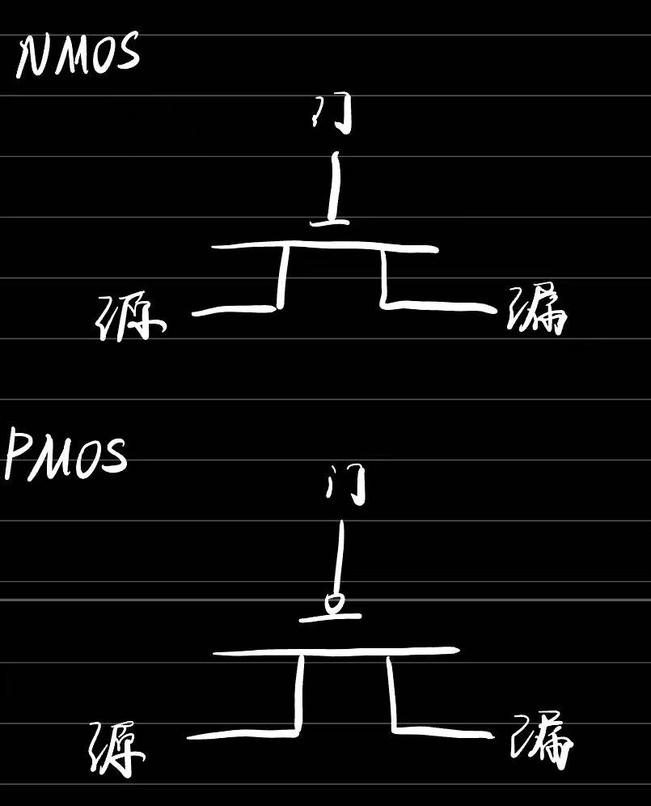
- 非门
  - 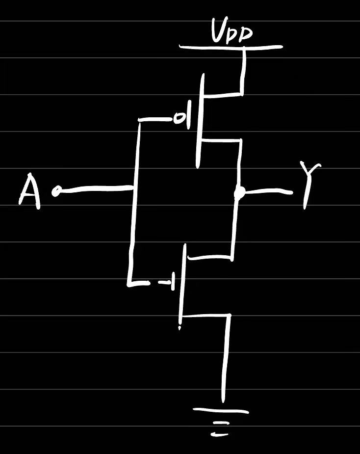
- 与非门
  - 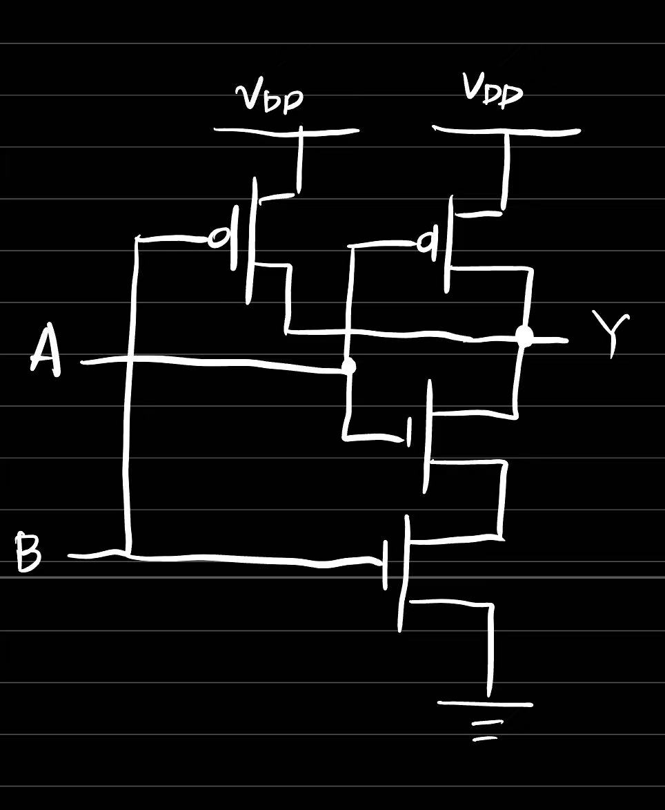
- 或非门
  - 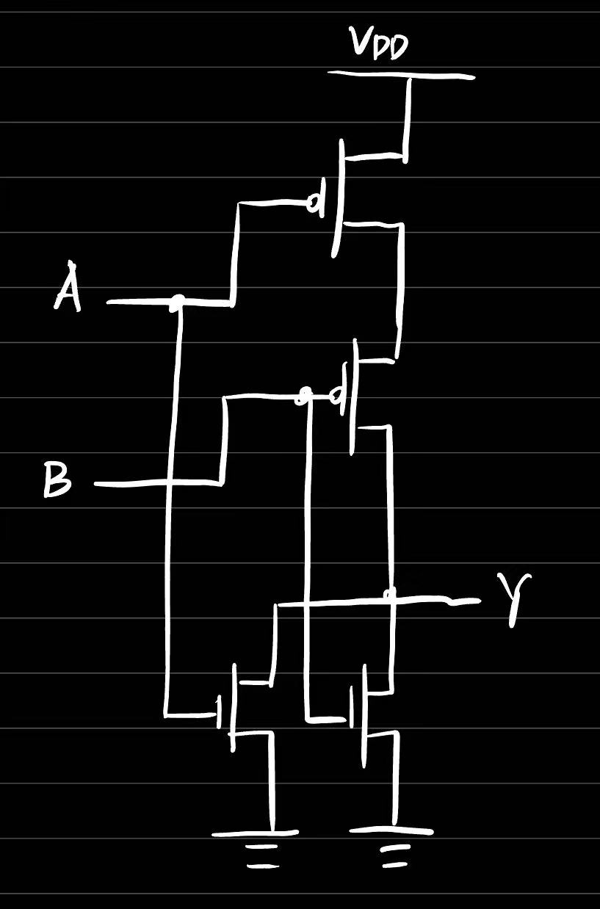
- 异或运算
  - $A\^B = (\lnot A \land B)\lor (A\land \lnot B)$
- ALU：与运算单元：32个与门并起来，或运算或门并起来+多选器
  - 能耗不友好，需要把控制信号连到对应的运算上减少不必要运算
- 半加器 / 全加器
  - 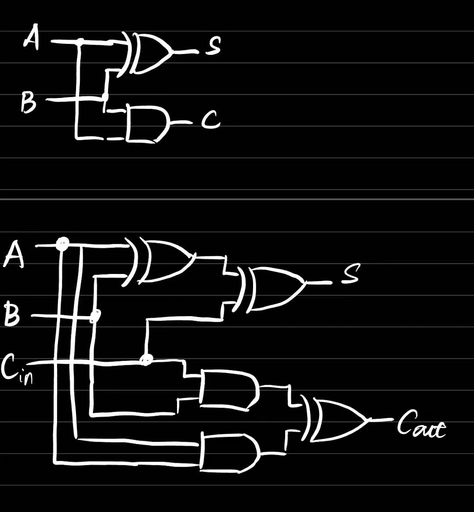
- 减法运算
  - A - B = A + (~B + 1)
- 多路选择器
  - 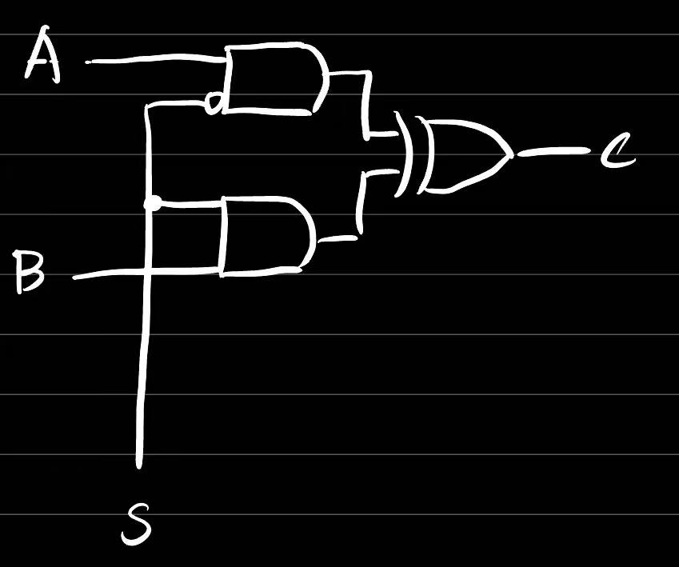

### 时钟和触发器
- D触发器
  - 具有存储信息能力的基本单元
  - 主要有一个数据输入、一个数据输出和一个时钟输入
  - 在时钟clock的上升沿（0→1），采样输入D的值，传送到输出Q，其余时间输出Q的值不变
- 具有存储功能的电路
  - 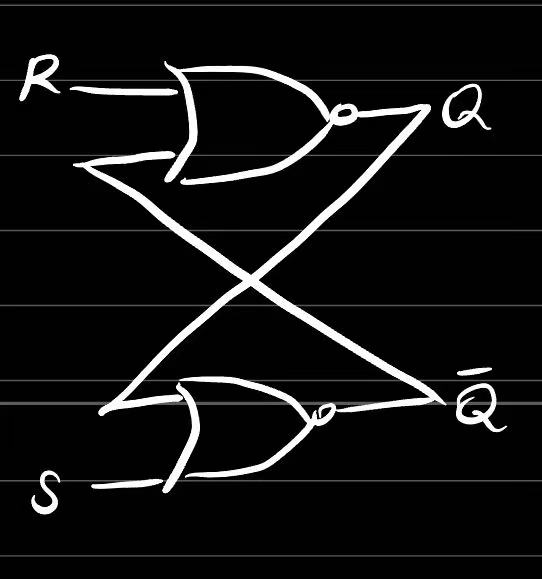
  - 当且仅当Set / Reset数据时改变输出
- D锁存器
  - 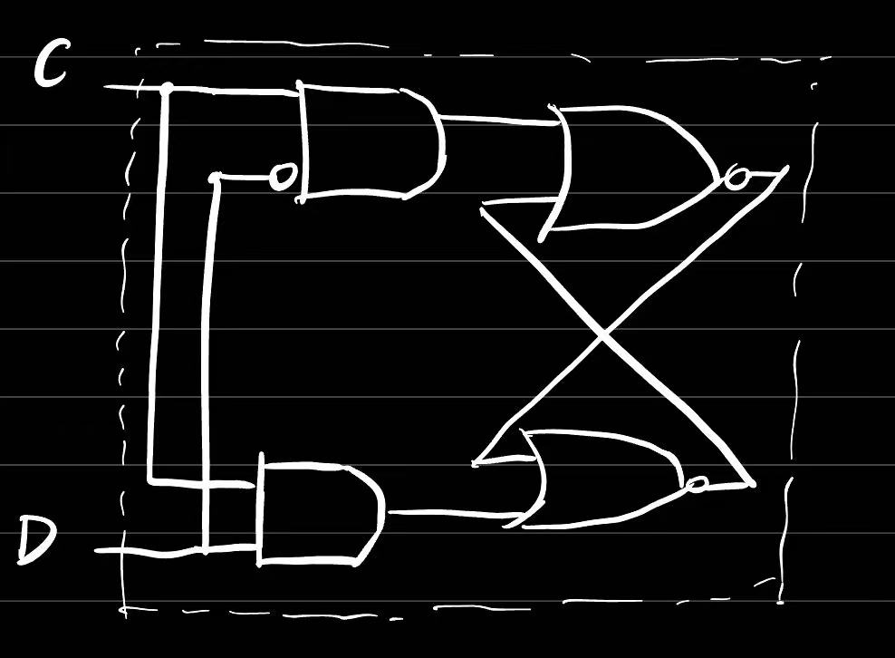
  - 在C为高电平时所存数据D
- D触发器
  - 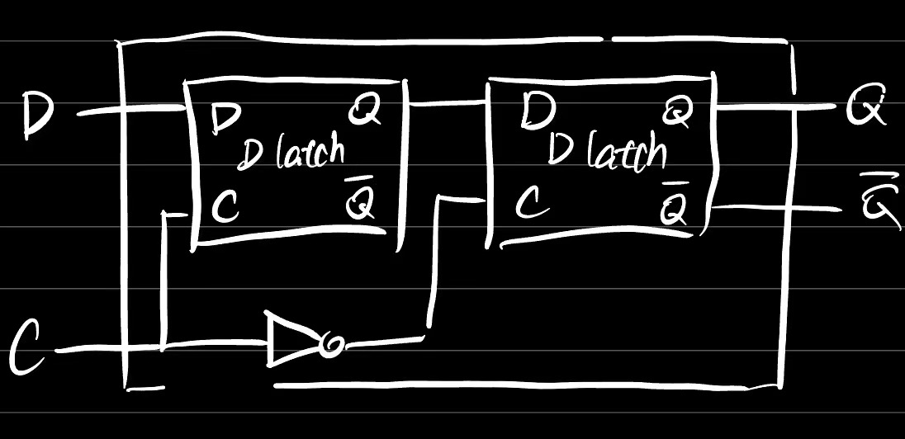
  - 该结构在时钟C下降沿时锁存数据D
  - 还有时钟上升沿触发的结构
- SRAM的基本存储单元
  - 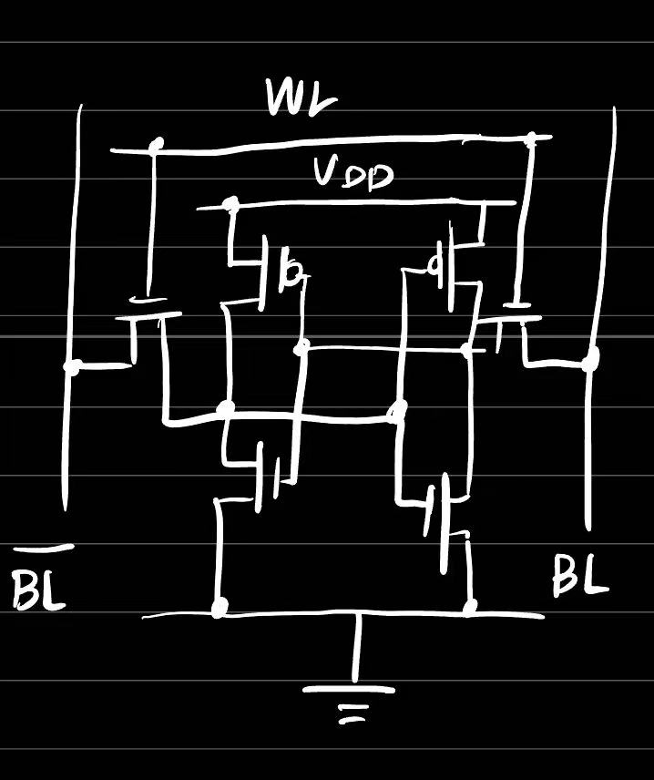
- SRAM的基本结构
  - 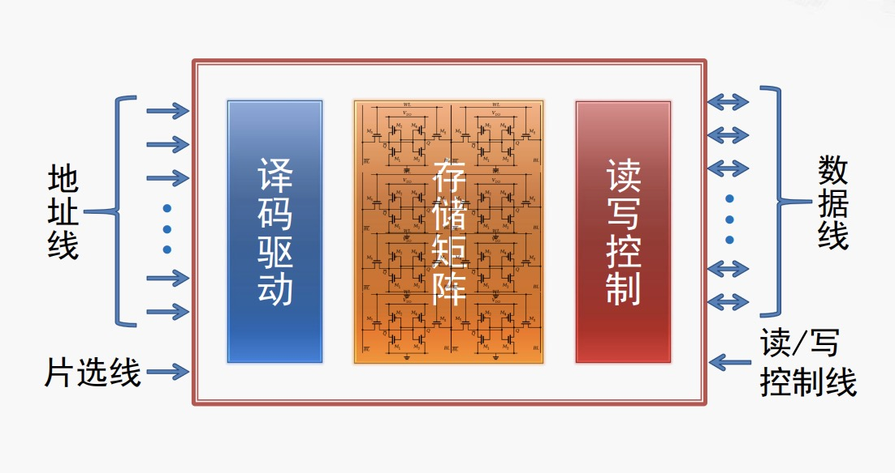

### 控制器的原理和分类
- 控制器的基本任务
  - 按指令每一步操作的需要，发出特定的命令信号
- 控制器的分类
  - 硬布线控制器
  - 微程序控制器
- 硬布线控制器
  - 也称硬连线控制器或组合逻辑控制器
  - 主要部件
    - 环形脉冲发生器
    - 指令译码器
    - 微命令编码器
  - 硬布线控制器的优缺点（小结）
    - 优点：
      - 执行速度很快
    - 缺点：
      - 控制逻辑的电路复杂，设计和验证的难度大
      - 扩充和修改也很困难
- 微程序控制器