### 数据库系统简介
- 数据管理技术的驱动力
  - 数据管理的任务
    - 定义存储的对象
    - 实现加工流程的操作
  - 数据结构
    - 逻辑 / 物理
  - 数据结构 + 算法 = 程序
    - 问题：完成需求后继续改动，如果遗漏某种查询方式较好解决，如果需要更改对象的数据类型则较复杂
    - 良好的数据结构 + 糟糕的代码 >> 糟糕的数据结构 + 优秀的代码
  - **数据独立性**
    - 数据管理追寻的目标
    - 定义：当数据结构发生变化时，通过系统提供的映象（转换）功能，使应用程序不必改变
      - 数据的物理独立性：当数据存储结构发生变化时，使应用程序不必改变
      - 数据的逻辑独立性：当数据逻辑结构发生变化时，使应用程序不必改变
  - 开发信息系统需要的管理三大帮助
    - 数据定义：逻辑结构 / 物理结构
    - 数据操作：查询 / 更新
    - 数据约束：数据合理范围
  - **数据独立性的实现**：把方方面面的数据管理的功能放到一个统一的软件中，*将数据管理从应用程序中剥离出来*
  - 发展历史
    - 文件系统阶段
      - 提供了一定的物理独立性
      - 文件的结构是由应用程序所定义的，数据结构发生变化会引发较大问题
      - 不同部门创建自己的独立数据
        - 多副本，浪费空间
        - 产生数据的不一致，信息孤岛需要信息集成
          - 联邦数据库技术，编写不同部门文件转换程序，4个程序需要12个转换程序
- 数据模型
  - 数据库管理系统的基石
- 数据库模式
  - 数据库应用系统的基石

### 数据库系统简介
- （缺到第二章中间）
- 语言翻译处理层：（集合级操作）
- 存取层：事务，日志，封锁，存取路径，提供单元组接口（记录级操作）
- 存储层：把操作系统的信息格式化成数据页面
- 操作系统
- 数据字典：表的结构...

### 实体-联系模型
- 三阶段数据库设计过程
  - 需求分析（不属于此）
    - 确定存储哪些数据，建立哪些应用，常用的操作及对象有哪些等
  - 概念数据库设计
    - 对需求分析所得到数据的更高层的抽象描述：最核心、最耗时的阶段
    - ER模型 UML
  - 逻辑数据库设计
    - 将概念模型所描述的数据映射为某个特定的DBMS模式数据
    - 四阶段此处有实现阶段：
      - 选择数据类型、定义表、约束、触发器
  - 物理数据库设计
- ER模型：信息模型
  - 把er设计作为数据库设计的第一步，切忌跳过er
  - 实体的描述方式+联系的描述方式
    - 实体
      - **客观存在**并可以**相互区分**的事物
      - 描述：实体具有的属性
      - 域：属性的取值范围
      - 实体型：实体名+属性名集合
      - 实体集：同型实体的集合
    - 联系：
      - 实体之间的相互联系
      - 联系也可以有属性
      - 联系的元：参与联系的实体集个数
        - 学生与学生的班长的联系是一元联系
    - 图表示
      - 实体集矩形，属性椭圆，联系菱形
      - 实体集不能多次出现
      - ER图的连通性意味着什么？
        - 联通的节点存在某种关联
        - 数据库设计中，若er图不联通则可以直接放到不同的数据库中
      - 实体集，而非实体
  - 实体的码
    - 超码
      - 能唯一标识实体的属性或属性组
    - 候选码
      - 其任意真子集都不能成为超码的最小超码
    - 主码
      - 从所有候选码中选定一个用来区别同一实体集中的不同实体
  - 联系的码
    - 一对多，“多”可以当做码（学生-老师）
  - er图中下划线作码
  - 多种码
    - 替代码：除去主码之外的候选码
    - 代理码：人工码，只起唯一标识作用的序列号
    - 自然码：一个与行中属性有逻辑联系的候选码，它是实体的“真正的”属性（院系名称）
    - 智能码：经过编码的标识符（对某些属性编码，便于流程处理）
  - 简单属性 复合属性
    - 简单属性：不可再分的属性
    - 复合属性：可以划分为更小的属性（电话号码=区号+本地号码）
    - 把相关属性聚集起来以反映更高层次的概念，可以使模型更清晰
  - 单值/多值：某个特定属性在改属性上的取值是否唯一
    - 多值属性需要单独存放
  - 派生属性：可以从其他相关的属性或实体派生出来的属性值（gpa）
    - 数据库中，一般只存基属性值，而派生属性只存其定义或依赖关系，用时再从基属性中计算出来
  - 多值属性多椭圆表示，派生属性虚椭圆表示
  - 空值（NULL属性）：表达当前“值未知”或“无意义、没有”
  - NULL属性对数据库设计的影响
    - 如果不支持NULL，数据库就无法录入缺失部分信息的实体
    - 如果不支持NULL，数据库就无法将稍具差异的实体放入同一模式中
    - 判断逻辑变为3值逻辑，true，false，unknown
    - 实体完整性：主码不能为空
  - 联系的种类
    - 一对一
      - 双箭头
      - 不是一一对应，某些实体可以不参与
    - 一对多
      - 用箭头或线段来表示联系的种类，箭头指向单方实体集
    - 多对多
      - 线段
  - 多元联系
    - 菱形多出口
    - 多元联系中最多允许出现一个箭头，表明多方决定唯一目的实体
  - 联系的势
    - 势表达了一个实体出现在联系中的次数（最少联系数，最多联系数）
    - 区分强制性和可选性联系
  - 参与
    - 部分参与
    - 全部参与
      - 实体集E中的每个实体都参与到联系集R中的至少一个联系
      - 双线链接
  - 角色
    - 一元联系中，当需要显式区分角色时，在连接菱形和矩形的线上加上说明性标注以区别不同的角色
  - 存在依赖
    - x存在依赖于y：实体x的存在依赖于实体y的存在
- 扩展的er模型
  - 弱实体
    - 还款如何刻画？
      - 不能由还款号唯一标识，不能成为实体？
      - 不能重复贷款号属性
      - 当做属性，不能刻画支付了哪一笔还款
      - 解决方案：
        - 定义**弱实体**
        - 双层矩形，联系也是双层
          - 标识性联系(identifying relationship)：弱实体集与其拥有者之间的联系弱实体集与强实体集之间是一对多的联系
        - 弱实体集的主码=强实体集的主码 + 弱实体集的分辨符
    - 何时使用弱实体？
      - 如果弱实体集不但参与和强实体集之间的标识性联系，而且参与和其它实体集的联系，或者弱实体集本身含有很多属性，则将其表述为弱实体集
  - 特化
    - 实体集中某些子集具有区别于该实体集内其它实体的特性，可以根据这些差异特性对实体集进行分组，这一分组的过程称作特化
    - 子类＝特例＝更小的实体集＝更多的属性
    - 父类 ➔ 子类
    - 倒三角表示
  - 概化
    - 各个实体集根据共有的性质，合成一个较高层的实体集。概化是一个高层实体集与若干个低层实体集之间的包含关系
    - 子类->父类
    - 概化 / 特化的问题
      - 高层实体集的属性被低层实体集自动继承
      - 格结构？
        - 双重父类->格结构
      - 概化中的成员身份
        - 两种成员身份
          - 不相交的
          - 有重叠的
      - 概化中的全部性约束
        - 全部的：每个高层实体必须属于一个低层实体集
        - 部分的：允许一些高层实体不属于任何低层实体集
      - 不想交+全部构成一种划分
  - 聚集
    - 三元表示问题
      - 职工-项目-机器
      - 直接写三元联系：有些职工并不和机器发生联系
      - 分为两个而元元素：损失哪个项目使用了什么机器的信息
      - 职工参加项目后才可能产生使用机器，“使用”应该指向“参加”
    - 把联系抽象成实体
  - 如何设计恰当的er图？
    - 抽象成实体还是属性
      - 实体有多方面性质，属性没有
      - 某个概念有唯一的码，应该抽象成实体
    - 属性分配到实体上还是联系上？
      - 不随联系改变的属性不放到联系上
    - 能否把多元联系转换为若干二元联系
      - 瓠瓜式通用转换方式
        - 可以，但没有意义
      - 能否用实体之间的二元联系替换三元联系
        - 不可以
        - 有损：重构的话会多出不存在的三元联系
        - 联系的属性：无处安放
    - 两个动作不太合适叠成三元联系
      - 两个动作的属性无法安放
      - 需要用聚集替换
- 概念数据库设计：
  - 局部设计-全局设计（消除局部er图的冲突（属性冲突 / 命名冲突））-全局优化（消除冗余）
- 逻辑数据库设计：
  - er图向关系模式转换
    - 实体->关系
    - 属性->关系的属性
  - 复合属性向关系模式的转换
    - 关系模型分量的取值具有原子性，符合属性只记录简单属性
  - 多值属性单独放到一个表里，避免冗余
  - 一对多联系向关系模式的转换
    - 将单方参与实体的码作为多方参与实体的属性
    - “多”的一方可以标识这个联系，因而可以在“多”的实体的表中放入
  - 多对多联系向关系模式的转换
    - 将联系定义为新的关系，属性为参与双方的码
  - 一对一联系向关系模式的转换
    - 都部分出现
      - 参与度低，新建一个表开销小
      - 参与度高，在原表中加一列
    - 联系一方全部参与
      - 将联系另一方的码作为全部参与一方的属性
  - 弱实体向关系模式的转换
    - 弱实体集所对应的关系的码由弱实体集本身的分辩符再加上所依赖的强实体集的码
  - 概括向关系模式的转换
    - 一般情况下，高层实体集和低层实体集分别转为表，低层实体集所对应的关系包括高层实体集的码
    - 如果概括是不相交并且是全部的，则可以不为高层实体集建立关系，低层实体集所对应的关系包括上层实体集的的所有属性
  - 聚集向关系模式的转换
    - 实体集A与B及其联系R被抽象成实体集C，C与另一实体集D构成联系S，则S的码由C和D的码构成
- 逆向工程：关系模式向ER的转换
  - 重合属性体现了实体之间的联系
- 如何对时态进行概念建模？
  - 概念模型反映该约束并不方便，需要借助数据库
- ER模型面向业务型应用，而非分析型应用(需要综合不同部门的数据)
- 底层业务处理 / 上层分析应用
  - 分析应用不契合ER模型

### 关系模型
- table
- 关系的基本概念
  - 笛卡尔积 -> 关系定义 -> 关系性质
- 笛卡尔积
  - 域
    - 具有相同数据类型的一组值的集合如整数集合、字符串集合、全体学生集合
  - 笛卡尔积定义在一组域上
  - 笛卡尔积的元素 𝑑1, 𝑑2, … , 𝑑𝑛称作n元组(tuple)
  - 若𝐷𝑖的基数为𝑚𝑖则笛卡尔积的基数为$\Pi_{i = 1} ^ n m_i$元组
  - 每一个值𝑑𝑖称作分量（component）
  - 刻画可能的世界
- 关系：笛卡尔积的（有意义）子集
  - 什么是有意义？
    - 关系集合包含了真正存在的实体或发生的联系
    - 关系名体现了现实实体或联系
  - 关系的性质
    - 列是同质的，是同一类型的数据，即每一列中的分量来自同一域
    - 不同的列可以来自同一域，每列必须有不同的属性名
    - 行列的顺序无关紧要
    - 任意两个元组不能完全相同（集合内不能有相同的两个元素）
    - 每一分量必须是不可再分的数据，称其为作满足第一范式（1NF）的关系
      - 嵌套关系多元素方不能反查（声明性查询 vs 路径式查询）
- 关系模型三要素
  - 数据结构
    - 单一的数据结构——关系
      - 无需为不同数据结构提供不同的操作
    - 实体集、联系都表示成关系
    - 码
      - 候选码
        - 关系中的一个属性组，其值能唯一标识一个元组
        - 若从属性组中去掉任何一个属性，它就不具有这一性质了，这样的属性组称作候选码
      - 任何一个候选码中的属性称作主属性
      - 主码
        - 进行数据库设计时，从一个关系的多个候选码中选定一个作为主码
      - 外码
        - 关系R中的一个属性组，它不是R的（主）码，但它与另一个关系S的（主）码相对应（不一定属性名相同），称这个属性组为R的外码
        - 一个联系对应一个外码
          - 有联系一定会产生外码
        - 外码可以是自己的主码
    - 总结
      - 关系模式包括
        - 关系名、关系中的属性名
        - 属性向域的映象，通常说明为属性的类型、长度等
        - 属性间的数据依赖关系，比如在特定的时间和教室只能安排一门课
      - 关系实例
        - 某一时刻对应某个关系模式的内容(元组的集合)
      - 关系数据库的构成
        - 关系数据库的型
          - 是关系模式的集合，即数据库描述。称作数据库的内涵(Intension)
        - 关系数据库的值
          - 是某一时刻关系的集合。称作数据库的外延(Extension)
  - 数据完整性
    - 实体完整性
      - 关系的主码中的属性值不能为空值
    - 参照完整性
      - 外码对应的值必须是存在的或空值
    - 用户定义完整性
      - 用户针对具体应用环境定义的完整性约束条件
        - sno要求是8位整数，首位是0或1
        - 两个属性之间的约束关系
        - 某属性的约束
        - 跨表、跨数据库的约束
  - 数据操作
    - 关系操作是集合操作操作的对象及结果都是集合，是一次一集合(Set-at-a-time)的方式
    - 非关系型（记录型）的数据操作方式是一次一记录(Record-at-a-time)
    - 关系数据语言的特点
      - 一体化：对象单一，都是关系，因此操作符也单一
      - 非过程化：用户只需提出“做什么”，无须说明“怎么做”存取路径的选择和操作过程由系统自动完成
      - 面向集合的存取方式：操作对象是一个或多个关系，结果是一个新的关系(一次一关系)非关系系统是一次一记录的方式
    - 抽象关系模型查询语言：
      - 关系代数：用预定义操作算子的执行序列来表达查询
      - 关系验算：用谓词来表达查询，只需描述所需信息的特性
        - 元组关系验算：谓词变元是元组
        - 域关系验算：谓词变元是属性列
- 关系代数运算
  - 基本
    - 一元
    - 多元
    - 具体运算
      - 选择运算$\sigma$
        - 在关系中选择满足给定条件的元组（行角度）
        - 选择条件
          - 𝐹是选择的条件， ∀𝑡 ∈ 𝑅, 𝐹(𝑡)要么为真，要么为假
          - 𝐹由逻辑运算符连接算术表达式而成
            - 逻辑表达式: $\land, \lor, \lnot$
            - 算数表达式：$X\theta Y$
              - 𝑋, 𝑌 是属性名、常量、或简单函数, 𝜃是比较算符，𝜃 ∈ {>, ≥, <, ≤,=, ≠}
            - 通常将过滤能力强或者佩戴索引的先执行
              - 数据库中的查询优化器所做
      - 投影运算$\Pi$
        - 从关系中取若干列组成新的关系（从列的角度）
        - 需要去重
      - 更名$\rho$
        - 必要性
          - 将更名运算施加到关系上，得到具有不同名字的同一关系
          - 当同一关系多次参与同一运算时需要更名
      - 并
      - 差
      - （广义）笛卡尔积
        - 集合级运算
        - 把多表数据融合到一个表中
        - $R\times S=\{ \hat{rs} | r\in R\land s\in S \}$
  - 扩展
    - 交
      - 可以用差解决
    - $\theta$连接
      - 先做笛卡尔积，然后再做theta运算
      - $\theta$为算术比较符，为等号时称为等值连接
      - $R_{A\theta B}^\bowtie S$
    - 自然连接$\bowtie$
      - 和等值连接完全不同，$\theta$连接不要求有重复的列(值相等即可)
      - 公共属性出现两表出现次数乘积次
      - 从两个关系的广义笛卡儿积中选取在相同属性列B上取值相等的元组，并去掉重复的列
      - 查询优化第一准则
        - 先做选择运算
      - 关于null的问题，需要有不同辩论
        - 数据库非外码关系时当distinct时会去重
        - 外码时数据库会抛弃，但按理取值范围一定，可能要匹配
      - 问题
        - 如果某表中没有某项会导致最终缺少行
        - 生成报表会出现问题
    - 外连接
      - 解决自然连接缺失的行
      - 外连接 = 自然连接 + 未匹配元组(悬挂元组)
      - 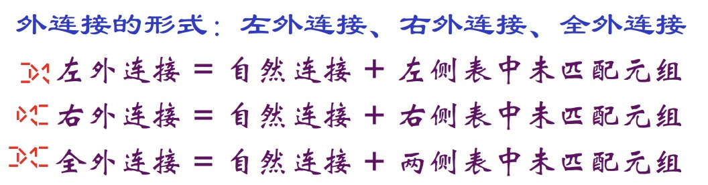
      - 自然连接满足结合律，外连接+自然连接不满足
      - 外连接+外连接也不成立，两个全外连接也会不成立
        - 全外连接的反例：(A, B), (B, C), (A, C)
    - 半连接
      - 给出R里可以参与与S自然连接的行
      - 应用场景：减少分布式查询中的通讯量
        - 两个表在两个节点
          - 方案1:迁移左表到右节点
          - 方案2:右表对应的属性->左节点->半连接结果发到右节点
    - 反半连接 anti join
      - 给出R里不能参与与S自然连接的行
      - 底层的物理操作符，用于not in / not exist
    - 外部并 outer union
      - 两个表结构不一定完全相同，按公共属性相同连接起来(有些可以指明公共属性组的一部分)
      - 从不同数据源汇聚用户画像
        - 实体识别：识别是否是同一个用户
      - 和外连接结果相同，初衷不同
    - 除法
      - 象集$Z_x$(Z，X是属性组，x是X的取值)
        - 选择+投影：从𝑅中选出在𝑋上取值为𝑥的元组，只留𝑍属性
      - 求选修了全部课程的学生
        - $\{ u | r\in SC\land u = r[name]\land C \subseteq COURSE_u \}$
        - $\{ u | u\in \Pi_{name}(SC)\land \forall v \in C(\hat{uv}\in SC) \}$(先把姓名和目标笛卡尔积再看是不是都在原始表里)
      - 定义表达式
        - $R(X, Y)\div S(Y) = \{x | r\in R\land x = r[X]\land S \subseteq Y_x\} = \{ u | u\in \Pi_X(R)\land \forall v\in S(\hat{uv}\in R) \}$
      - 计算表达式
        - $R(X, Y) = \Pi_X(R) - \Pi_X(\Pi_X(R)\times \Pi_Y(S) - R)$
        - 投影同学(所有可能的选课情形 - 实际发生的选课关系) = 所有没选完所有课程的同学，减去这些同学即得答案
          - 减法操作区别不同性质子集的作用
        - 下面的除法是错的
          - 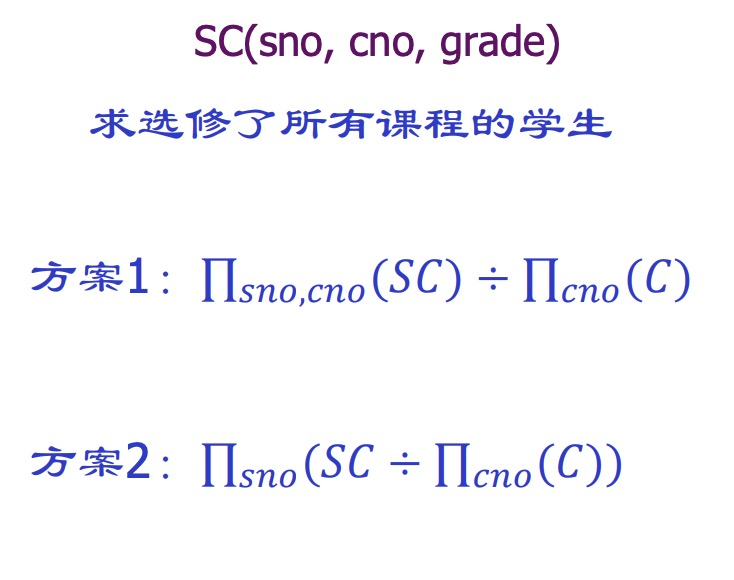
          - 这个除法要求姓名+成绩相同才能被除出来
  - 关系代数更新运算
    - 赋值运算
      - 临时关系变量 <- 关系代数表达式
      - 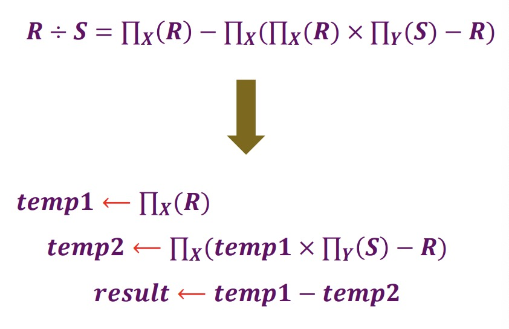
    - 删除
      - 作差
    - 插入
      - 并
    - 更新
      - 广义投影(不明白为什么放在这里)
        - 
      - 利用广义同影改变元组的某些属性上的值
  - 关系代数查询实例
    - 在树的结构中，查询所有祖父(递归查询)，是无法用关系代数操作完成，实际数据库会使用递归查询完成
    - 最低成绩查询：要基于现有性质完成查询
- 关系验算
  - $\{t|P(t)\}$
    - 𝑡 为元组变量，如果(P(t)中)元组变量前有全称(∀)或存在(∃) 量词，则称其为约束变量，否则称为自由变量
  - 行：元组关系验算
  - 列：域关系验算
  - 原子公式
    - 𝒔 ∈ 𝑹。𝒔是关系𝑹中的一个元组
    - 𝒔 𝑿 𝜽 𝒖[𝒀]。𝒔[𝑿]与𝒖[𝒀]为元组分量，它们之间满足比较关系$\theta$
    - 𝒔 𝑿 𝜽 𝒄.分量𝒔[𝑿]与常量𝒄之间满足比较关系$\theta$
    - 公式为从原子公式递归定义的
    - $P_1\Rightarrow P_2\Leftrightarrow \lnot P_1\lor P_2$
  - 任意任意可以交换顺序，存在存在也可以，任意存在或存在任意不行
  - 关系验算的安全性
    - 元组关系演算有可能会产生无限关系，这样的表达式是不安全的，如 \{𝑡｜ ┑(𝑡 ∈ 𝑅) \}, 求所有不在𝑅中的元组
    - 引入公式𝑃的域概念，用𝑑𝑜𝑚 (𝑃) 表示𝑑𝑜𝑚 (𝑃) =显式出现在𝑃中的值 + 在𝑃中出现的关系的元组中出现的值（不必是最小集）如定义𝑑𝑜𝑚 (𝑡 | ┑ 𝑡 ∈ 𝑅) = {𝑅中出现的所有值的集合}
    - 如果出现在表达式{𝑡|𝑃 𝑡 }结果中的所有值均来自𝑑𝑜𝑚 𝑃 , 则称{𝑡|𝑃 𝑡 }是安全的
  - 域关系验算形式化定义
    - \{< 𝑥1, 𝑥2, … , 𝑥𝑛 > 𝑃(𝑥1, 𝑥2, … , 𝑥𝑛)\}𝑥𝑖代表域变量， 𝑃为由原子构成的公式
  - 关系代数的非过程性：面向集合而不是面向记录
  - 关系验算的非过程性：只需要指出性质
- 补充材料
  - 包：允许重复的集合，或者多集（multi-set）
    - 作差剩下的数目为被减数里的数目-减数里的数目
  - 作为约束语言的关系代数
    - 𝑹 = 𝝋(R的选择结果为空) 或者 𝑹 ⊆ $S$
  - 全关系系统
    - 表式系统
      - 仅支持关系(即表)数据结构，不支持集合级操作。表式系统不能算关系系统
    - 最小关系系统
      - 仅支持关系数据结构和三种关系搡作。许多微机关系数据库系统如FoxPro属于此类
    - 完备关系系统
      - 支持关系数据结构和所有的关系代数操作。90年代初的许多关系数据库管理系统属于这一类
    - 全关系系统
      - 这类系统支持关系模型的所有特征,特别是数据结构中域的概念,实体完整性和参照完整性
    - 全关系系统的12条特征，考察功能是否完善
      - 准则 0：一个关系型的DBMS必须能完全通过它的关系能力来管理数据库
      - 1: 关系型DBMS的所有信息都应在逻辑一级上用一种方法即表中的值显式地表示
      - 2：要用表存
        - 依靠表名、主码和列名的组合，保证能以逻辑方式访问关系数据库中的每个数据项（分量值）以关联寻址代替面向机器的访问方式
      - 3: NULL
        - 全关系型DBMS应支持空值概念，并用系统化的方式处理空值(数据库处理之，而非应用程序)
        - not in: NULL比较->false
        - not exist: NULL比较->true
      - 4: 基于关系模型的动态的联机数据字典
        - 数据库的描述在逻辑级上应该和普通数据采用同样的表示方式，使得授权用户可以使用查询一般数据所用的关系语言来查询数据库的描述信息
      - 5: 统一的数据子语言
        - 一个关系系统可以有几种语言和多种终端使用方式（如QBE、嵌入式SQL），但必须有一种语言，它的语句可以表示为具有严格语法规定的字符串
      - 6: 视图更新准则
        - 视图是指一种把表抽象出来的视角，比如学生表的几列组合出来作为一个视图，比如没有主码的视图插入或着不通过唯一码定义的查表并重新set唯一码的操作是理论上不可更新的
        - 所有理论上可更新的视图也应该由系统更新，即对视图的更新要求，存在一个算法可以无二义地把更新要求转换为对基本表的更新序列
      - 7：高级的插入、删除和修改操作
        - 关系系统的操作对象是单一的关系
      - 8：数据物理独立性
        - 无论数据库的数据在存储表示和存取方法上作任何变化，应用程序和终端活动都保持逻辑上的不变性
      - 10：数据完整性的独立性
        - 关系数据库的完整性约束条件必须是用数据库语言定义并存储在数据字典中的，而不是由应用程序加以定义
      - 11：分布独立性
        - 分布独立性是指DBMS具有这样的数据库语言，使得应用程序和终端活动在下列情况下都保持逻辑上的不变性：
          - 在第一次引入分布式数据时，即如果原来的DBMS只管理非分布式的数据，而现在引入了分布式数据
          - 当数据重新分布时，即如果原来DBMS能管理分布式数据，现在要改变原来的数据分布
      - 12：无破坏准则
        - 如果一个关系系统具有一个低级(一次一记录)语言，则这个低级语言不能违背或绕过完整性准则
          - 为获得完整性的独立性，需要让完整性约束条件和数据的逻辑结构相独立
          - 不能旁路(bypass)或者关闭约束检查子系统

### SQL：索引定义
- 索引概念上可以理解为指向原表对应行的指针(RowID:(文件号，页面号，页内偏移号))
- 数据库的索引是由B+树实现的
  - B+树所有的叶都是双向指针完成的，所有的数据放在叶子上
- 索引作用
  - 查找元组
  - 排序
  - 表连接(可以实现归并连接)
  - 分组
  - 保证唯一性
- 索引有时需要改变排序方式
- primary key, unique index也会建立索引
- 创建索引选项：InnoDB_fill_factor
  - 索引有序
  - 索引页如果放不下会导致页面的拆分
  - 用的太狠频繁拆分会导致性能下降
  - fill_factor指定在创建索引的过程中，各索引页的填满程度
    - 某些页面尽可能留出空间以便将来使用
- 索引碎片
  - 逻辑顺序和物理顺序可能不一致
  - 物理上隔开的逻辑的顺序查询会导致查询性能下降
  - 解决方案：检测索引碎片超过某个阈值则重建
- 聚簇索引：
  - 表中元组按索引项的值排序并物理地聚簇在一起
  - 一个基本表上只能建一个聚簇索引
  - 使逻辑顺序和物理顺序一致，加速诸如顺序读取的速度
  - create cluster index
- 组合索引
  - 建立在多个属性列上的索引
  - 依次按被组合属性的顺序排序
  - 在查询时只对按首索引查询有效
  - 区别于单列索引的作用：
    - 按组合序查询
    - SELECT 第二列 WHERE 第一列 > 10
      - 原始的索引有可能整表扫描快于索引(省去跳回原表拿到第二列的时间)，导致磁盘指针随机跳动(顺序读速度发展的很好)，满足条件的数据并非足够少
      - 之前为了获得第二列所以需要跳回原表，现在把第二列也放到索引上了，因而不需要再跳回原表
      - 等号过滤能力很强，所以组合等号对应项最好在前
- 覆盖索引
  - 组合索引中除第一项外其他项只出现在叶节点上，内部节点中不再出现
- 过滤索引
  - 唯一值太少的不适合做索引（男女各一半），但是女生很少则适合
  - 只对一少部分人做索引（只对女生）-- 如果列值分布倾斜，可只对稀疏区间建立索引
  - create index filter_idx3 on student(age) where age >= 27
- 函数索引
  - 表里存放的姓名是Tom，用户查询条件五花八门：tom, tOm, ToM
  - select * from student where UPPER(name) = ‘TOM’
  - 如何构建索引？
    - 原始索引对次无效，不知道他们是否一致
    - 可以对函数做索引
      - create index idx2 on student(UPPER(name))
      - 按省份证号的生日子串做索引：create table myTb (id char(18), index idx3 (substring(id, 7, 8) ) )
- 索引
  - 内模式
  - 一个表上可建多个索引
  - 可以动态地定义索引，随时建立和删除索引
  - 优点
    - 索引可以提高查询效率
  - 缺点
    - 耗费空间
    - 降低插入、删除、更新效率
  - 理想化状态，希望用户只看外模式，模式层面，不涉及内模式，具体调用哪个索引由数据库内部使用（物理独立性）
    - 但是不理想时用户可以执行强制选择索引
      - select … from MyTb force index(idx_name)
      - 不是所有sql都长这样
  - 是否适合做索引？
    - 索引的理想选择度 = 1 / 索引列的唯一值个数
    - 选择度越小越适合做索引
  - 未必使用了索引效率就一定变高
    - 取决于 索引的实际选择度 =查询结果行数/总行数
    - 为什么选择度的启用从20%->2%？
      - 磁盘顺序查找变快，全表扫描速度变快
      - 数据库内部画直方图估计
  - 索引的选择（数据库的索引推荐）
    - 企业提供常见索引的频率占比
    - 表中的读取次数：sno索引Q1：3次数据页+1次索引页=4次
    - 插入：读数据页，写入，写回数据页
      - 有索引的话需要同时更新索引页
    - 结合执行频率得到不同建索引的代价
    - 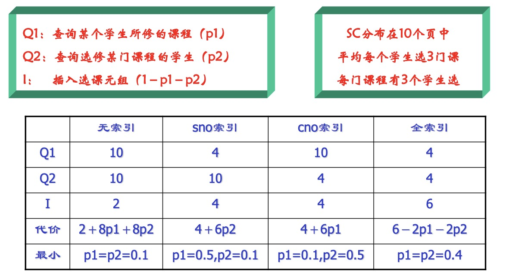

### SQL：嵌套子查询
- 可能单层select无法表达复杂查询
- 主要类型：in，some/all，exists
- 表达式 [not] in (子查询)
  - 判断表达式的值是否在子查询的结果中
  - 可以作复杂问题的分解（查询出来一部分，另一部分结果要求in这里）
  - 用in只表示查询思路，系统上会做查询优化，基本上不管怎么查都能找到优解
  - find_in_set()函数
    - 对in的补充
    - find_in_set(sname, '张军, 王红')
    - 感觉跟in('XX', 'YY')一样
  - some / all
    - select value1 from Comp1 where value1 > some (select value2 from Comp2);
    - 只要大于后面的一个就行
    - 改成all就要大于全部
    - all可以查询诸如平均成绩最大的学生
  - [not] exists （子查询）判断子查询的结果集合中是否有任何元组存在
    - 若子查询返回\{null\}，exists会返回真
    - 相当于对上一个查询加上探测条件->称exists为相关子查询
  - 除法
    - 可以使用双重否定
    - 求选修了所有课程的同学，等价于不存在任何一门课程不在学生的选课清单中
      - 也可以用count是否是整个count
    - 求修了S1同学修的所有课的同学等价于，不存在任何一门课程，S1修了它但是S2没有修它
  - 对于子查询中的列，采用就近匹配的原则来解析列属于哪个表，如果在内层表中找不到的话，则会到外层表中尝试去匹配
  - 对于有NULL的情况，not in 和 not exists可能返回结果不同
    - 1=null判断结果为unknown，not unknown = unknown
    - not in：非真即假
      - select * from T_1 where A not in ( select * from T_2 )
      - 相当于执行 select * from T_1 where A not ( A in(null) )
      - 表达式A in(null) 返回unknown，故not ( A in(null) )也返回unknown
      - (in(null)，=null返回结果是unknown)
    - not exists：非假即真
      - select * from T_1 where not exists ( select * from T_2 where A=B)
      - 子查询的执行结果为空集，故exists返回false， not exists返回true
    - 区别在于判断unknown前者在上一个查询中，后者在子查询中

### SQL脚本语言
- 服务器端的编程
- 批处理
  - 批处理是包含一个或多个SQL语句的组，从应用程序一次性发送到服务器执行，服务器将批处理语句编译成一个可执行单元
  - 错误处理
    - 编译错误全部直接不执行
    - 运行到某个语句错误，之前做完的会保留，但是后面的不会进行
      - 表名是延迟解析的，列名不是，出错会报编译错误
  - 局部变量 
    - declare @find varchar(10)
      - declare @变量名称 数据类型
    - set @find = '张%’
      - set @变量名称 = SQL表达式
  - 错误处理：
    - SQL Server
      - begin try
      - { SQL 语句 }
      - end try
      - begin catch
      - { SQL语句 }
      - end catch
      - 与mysql写法不同
  - sql与过程化执行方式的差别
    - SQL：一次一集合
    - 过程化执行：一次一记录
    - 需要记录级处理的场合
      - 复杂任务（如 逐条打印）
      - 有序处理（“下一个怎么怎么样”）
    - 进行过程化处理：游标
      - 游标：在查询结果的记录集合中移动的指针
      - 类别
        - 滚动游标：游标位置可以来回移动，可在活动集中取任意行
        - 非滚动游标：只能在活动集中顺序地取下一行
        - 更新游标：系统对游标指向的当前行加锁，当程序读下一行数据时，本行数据解锁，下一行数据加锁
      - 使用过程
        - 声明游标
          - declare 游标名 [ insensitive ] [ scroll ] cursor for select语句 [ for update [ of列表名 ] ]
            - insensitive：游标走开再回去的时候如果又被改了，一般会返回新的值，这个选项要求返回地读结果是相同的（把数据库复制到另一个地方，与原始数据库隔离）
        - 打开游标
          - open 游标名
            - 打开一个游标，执行游标对应的查询
            - 结果集合为该游标的活动集
        - 检索游标
          - fetch [next | prior | first | last | current | relative n | absolute m ]
        - 关闭游标
          - close
        - 释放游标
          - free
        - 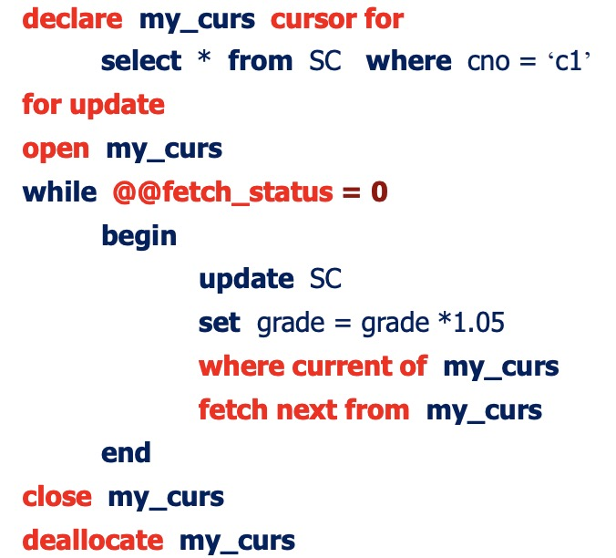
        - fetch_status：表示之后没有数据 / 越界
    - 动态SQL：产生SQL的SQL
      - student_id = ‘s01’
      - prepare sqlState from “delete from student where sno = ? " execute sqlState using : student_id
        - ？：占位符
      - 可以通过此
        - 创建一个1000列的表
        - 购物页面到动态筛选选器，省掉对用户没有输入的部分使用or判断（or会导致数据库放弃使用索引）

### 存储过程与函数
- 存储过程
  - 存储过程将程序在服务器中预先编译好并存储起来，然后应用程序只需简单地向服务器发出调用该存储过程的请求即可
  - 业务逻辑模块化的封装，执行效率（一般）高效
    - 执行效率高
    - 重复使用
    - 统一的操作流程
    - 维护业务逻辑
    - 安全性
  - 效率问题
    - 如果存储过程的执行计划是一成不变的，则随着时间推移，该计划有可能变得是次优的、过时的
      - 比如数据分布发生变化，后续创建了索引
    - 随着存储过程输入参数的不同，有可能对应着不同的最优的执行计划
    - 存储过程的命令格式：MySQL
      - create procedure 存储过程名 [参数 数据类型 ]begin 存储过程SQL体 end 
      - 需要加delimiter $$
        - 为了避免与存储过程中SQL语句结束符相冲突，需要使用DELIMITER改变存储过程的结束符。
      - 存储过程可以相互调用，也可以调用自身，从而实现递归
    - 用户定义函数
      - 用户定义函数：用于封装经常执行的逻辑的子例程
      - 用户定义函数与存储过程的区别
        - 存储过程只能返回一个整数值，用户定义函数可以返回各种数据类型
        - 存储过程可以做任何数据库修改，用户定义函数不可以修改数据库
        - 存储过程只能由exec来执行，不能用在表达式中，用户定义函数可以由exec来执行，也可以用于表达式中或from子句中
        - 存储过程一般用于对数据库修改或设置，用户定义函数则适于提取数据

### 触发器简介
- 监测到数据库产生了感兴趣的内容则推送过去
- ECA：Event-Condition-Action（事件－条件－动作）
  - E：指明监视哪些事件：Insert、 delete、update
  - C：指明什么条件下触发器被执行
  - A：指明触发器执行的动作是什么
- 作用：
  - 维护约束：防止在选定一门课后删除该课程
  - 辅助缓存数据一致性的维护：物化视图-可以把用户经常访问的数据先拿出来，mysql没有，用户可以自行放到另一个表里，需要维护这里的数据和数据库里的数据的一致性
    - 基数据表变化不希望整个表改变，这里需要做增量计算
  - 维护商业规则：向客户发送短信通知其物流信息
  - 监控：传感器感知到一氧化碳浓度级别提高，则开启通风系统
  - 简化应用设计：数据异常可以放到一个特定的模块，将核心编程逻辑从异常处理中分离出来
- 行级除法器的定义
  - 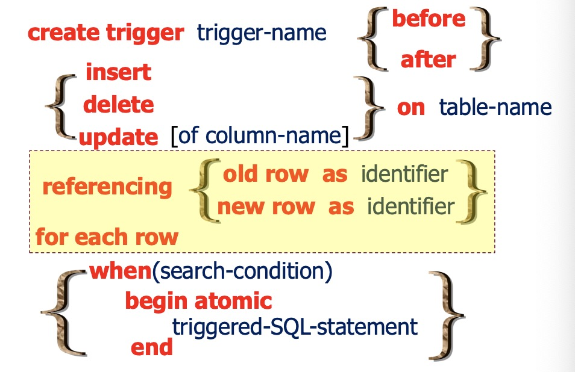
  - referencing: 把更新前后的值记到两个变量里
    - for each row：对影响到的每一行作之后性温
      - when+条件
      - +行为
- 语句级触发器的定义
  - 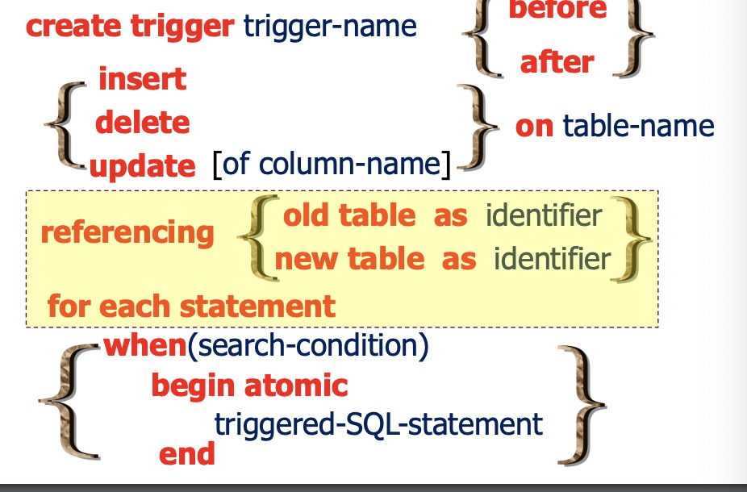
  - 对整表的状态检查，把所有整体的被改变的行放到临时表里
- before除法器
  - 之前都是after，监视的更新事件发生后检查
    - 先监视E的条件发生后执行A
  - before在
    - 先执行动作再进行事件E：
      - 不及格的同学先把成绩改为60再插入
    - 可以进行完整性约束的模糊
  - 触发命令非常复杂，不同数据库的命令不同
    - SQL Server和之前所述的区别：
      - 内置了deleted和inserted
      - 省掉了oldrow，newrow的自定义数据名
      - 不能直接逐行检查，但是可以借助游标
  - 递归触发器
    - 触发器可能导致更新动作，这个更新动作可能导致其他触发器被触发
    - 设计触发器，保证部门预算始终等于该部门预算与其所有子部门预算之和
    - 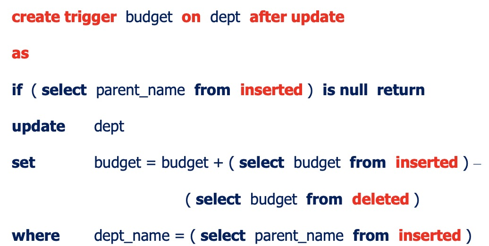
  - 替代触发器
    - 用A替代你所监视的E
    - 通常可以将对视图的插入把NULL更改为默认的值
    - 对由连接的生成的视图（通常系统不允许直接update），通过触发器把更新意图描述清楚
  - 触发器只能监视单个表上的更新事件如果监视目标涉及到多个表该怎么办？比如连接或者交集
    - 可以定义一个视图，触发器定义在视图上面
  - 当一个事件同时激活多个触发器时，触发顺序如何确定？
    - 分组冲突解决方案（如发布-订阅触发器）
      - 同时计算所有触发器的前提条件，然后调度执行所有前提条件为真的触发器
    - 有序冲突解决方案
      - 轮流计算触发器的前提条件。当一个条件求值为真时，执行相应的触发器；当执行完成时，考虑下一个触发器
      - 冲突（比如一个触发器的行为跟掉另一个触发器的行为不同）时，可以
        - 方案一：设定触发器触发优先级；方案二：合并成一个触发器

### 数据库的完整性
- 完整性
  - 列级约束：对一个列声明约束
  - 行级约束：同一行各列之间
  - 表级约束：行间、表上、表间
- 约束类型
  - primary key
  - foreign key
  - unique
  - default
  - not null
  - check
- 存储约束的系统表：sysconstraints（被略过了）
- 约束命名及其定义
  - constraint 约束名 <约束条件>
    - sno char(8) constraint Sno_PK primary key
  - 撤消约束：alter table…drop constraint…
  - 添加约束：alter table…add constraint…（这里可以填一列加在原来的表上）
- primary key 与 unique 的区别？
  - unique可以取null，单列只能取一个null
- foreign key
  - 基本关系：主码所在的关系
  - 依赖关系：外码所在的关系
  - 对基本关系的更新需要限制以保证参照完整性（删了这的主码别的表都外码没了）
    - 外码定义三种方式解决此
      - on delete RESTRICT：只有没有外码参照此主码的时候主码才能被删
      - on delete CASCADE ：主码没了外码所在表的项也被删掉
      - on delete SET NULL：主码被删了外码置空
  - 表级约束：涉及多行或多表之间的影响
    - check(sno in (select sno from S)
    - 这个跟外码不一样，只有对这个表做更新才有检查，但是对S更改不会触发检查
    - 约束检查的问题
      - 相互参照的表，如何插入行？
        - 两个表每一个会因为外码不存在而无法插入
        - 一种麻烦的方式是，一个开关，在插某个表的时候关闭约束
      - 如何往自参照的表里批量插入数据？
      - 解决方案：延迟约束
        - 将多个更新操作语句放入一个事务，在提交时才检查约束
        - 一组更新操作都做完之后再检查约束
      - 在约束创建时：
        - [not] deferrable initially deferred [immediate]
      - 对现有约束：
        - set constraint 约束名 deferried
      - sel server不支持约束，插入时可以用nocheck检查，之后插入完再做检查
        - dbcc checkconstraints：将违反约束的部分列出来
  - 断言assertion：数据库状态不应该违反某个约束
    - create assertion AtoB check (not exists ... )
    - 一般数据库不支持，因为需要系统以高代价找对应表等维护
    - 可以用函数约束：可以把某个函数的值作为验证
      - 也可以要求新进来的条目用缺失的最小序列号：alter table noGap add constraint DF_no default ( fn_noGap_ minUnusedKey () ) for no
      - （最小不存在的序列号：原表序列号加一不在原表中的最小值）

### 数据库的安全性
- 安全性
  - 准入：合法用户，身份鉴定，标识 +口令
  - 权限：存取范围，只能干什么 pk 不能干什么
  - 配额：资源控制，粮票、阶梯水费、DOS、DDOS
  - 审计：无处不在的探头，一切皆有案底
  - 加密：防止DBA看到用户信息
- 主体
  - 主体(principal)：是可以授予权限以访问特定数据库对象的对象，包括登录用户、角色、应用程序
  - 范围
    - Windows登录用户
    - SQL Server级别的主体：
      - SQL Server级别的登录名和固定服务器角色
    - 数据库级别的主体
      - 数据库用户、数据库角色、应用程序角色
      - 通过create user user_name命令创建
      - 角色
        - 角色是一组相关权限的结合，即将多个不同的权限集合在一起就形成了角色
        - 处于某一岗位的人具有相应的权限
        - 创建数据库角色：create role role_name
        - 添加登录名到固定服务器角色：sp_addsrvrolemember sp_addsrvrolemember ‘sweetHeart’, ‘sysadmin’
- 客体：被操作的对象
- 权限
  - 可以被转授，有权限的用户可以转给别人
  - 授权图
    - 跟节点是DBA
  - 转授的权限需要在回收的时候被回收
    - 需要处理相互转授的情形，级连地回收到底
  - 授权命令
    - grant 权限 to {用户 [，用户]… | public} [with grant option]
    - with grant option 获得权限的用户可以把权限再授予其它用户
    - 为什么需要references权限？
      - 防止被通过在这个表里插入看是否报错探测你的表是否有对应项
  - 回收权限：revoke
  - 可以通过查询user全局变量得到现在的用户，根据此生成访问的范围
  - 只授权查看平均工资的权限：建立平均工资的视图
  - 访问控制类型
    - 自主访问控制（DAC）
      - 对客体拥有控制权的主体能够将对该客体的访问权自主地授予其它主体，并在随后任何时刻将这些权限回收
    - 强制访问控制（MAC）
      - 每个主体和客体分配相应(许可证)密级，访问权限(保密性规则)由系统控制
      - 保密性规则
        - 下读：仅当主体许可证级别高于或等于客体密级时才能读取相应客体
        - 上写：仅当主体许可证级别低于或等于客体密级时体才能写相应客体(避免泄密)
  - 审计
    - 审计就是对指定用户在数据库中的操作情况进行监控和记录，用以审查用户的相关活动
      - 安全性：权限审计
      - 功能性：收集活动信息优化数据库
  - 加密
    - 防止DBA
    - 短语加密
      - encryptByPassPhrase ( { 'passphrase', 'cleartext'})
    - 非对称密钥加密
      - RSA
    - 对称密钥加密
      - DES(转成64位+16次位变换)
  - SQL注入
    - 在WEB上输入特殊字符发到数据库导致信息泄密
    - 在验证密码的时候恶意的加上 or 'x' = 'x'
    - 通常会过滤敏感字符以防止注入攻击
  - 资源控制：Oracle
    - 在合法范围内滥用资源会破坏数据库
    - 把数据库资源按份额分给用户
    - CPU使用时间限制 CPU_PER_SESSION、逻辑读个数限制 LOGICAL_READS_PER_SESSION...
  - 统计数据库的安全性
    - 要求：用户只能查询数据的聚集值，不能访问个体
    - 可能存在的漏洞1: 个体太少
      - 拒绝返回结果，查询的个体数不能少于某个阈值
    - 可能存在的漏洞2: 多次查询，作差求出交集
    - 防范措施
      - 查询引用的数据不能少于𝒏
      - 两个查询的交不能多于𝒎
  - 隐私保护
    - 数据发布：隐去姓名地发布个体信息
      - 连接推理的威胁：这样仍不安全，两份不设计个体隐私的数据碰撞的时候某特定个体可能会被定为
      - k-anonymity
        - 有相同的准标识属性组(QI)的元组至少有k个
        - k越小信息泄露的可能越高

### 非关系数据模型
- 如何在关系型数据库中管理非关系数据模型
- 层次结构 & 递归查询
- 层次结构
  - 数据结构：树、有向图、无向图
  - 操作需求：求父节点、子节点、环路检测、传递闭包、最短路径
  - 问题
    - 如何递推当前节点的所有的叶子节点？
      - 关系代数：逐级做自己的笛卡尔积，用sql实现——太啰嗦了
      - 考察关系代数的存储方式
        - 基本事实+规则->全部事实
        - 直接的父子关系+孩子的孩子仍是孩子->全部的祖辈关系
        - 一种存储方式是只存基本规则，用sql负责关系
        - 另一种是把全部的都算出来(查询较快，更新代价较高)
    - 如何推倒当前关系数据的对称闭包和传递闭包？
  - 层次结构的存储
    - 领接表：直接存储父子关系
    - 物化路径
      - 记录从根节点到当前节点的路径
      - 调整数据很复杂，适用于数据静态时
    - 嵌套集合
      - 每个节点分配左值和右值
        - 左值和右值的区间覆盖子节点的区间
      - 好处：查找子节点只需查所有范围属于自己的
  - 基于邻接表的查询方式
    - Oracle语法
      - `select part, subpart, level
        from Components
        start with part = ‘trike’
        connect by prior subpart = part`
      - connect by prior subpart = part自上而下搜索：先找父节点然后找子节点
      - connect by subpart = prior part自下而上搜索：先找子节点然后找父节点
    - MySQL语法
      - 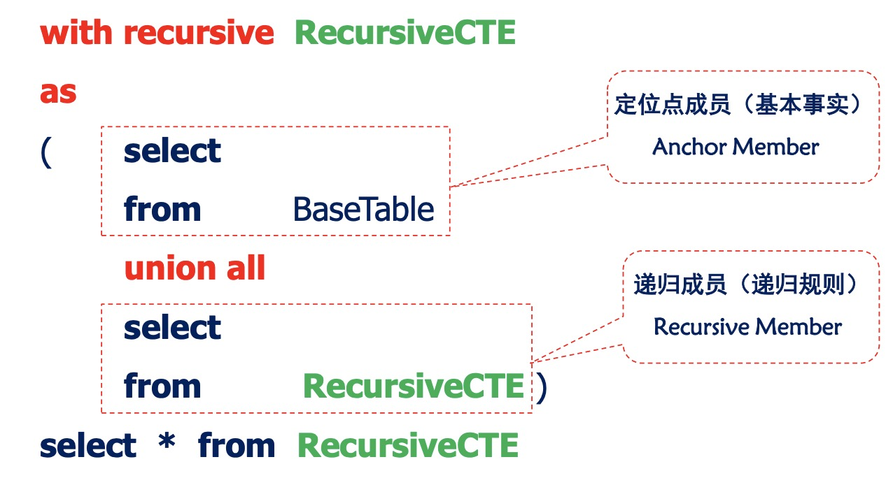
      - 求和
        - 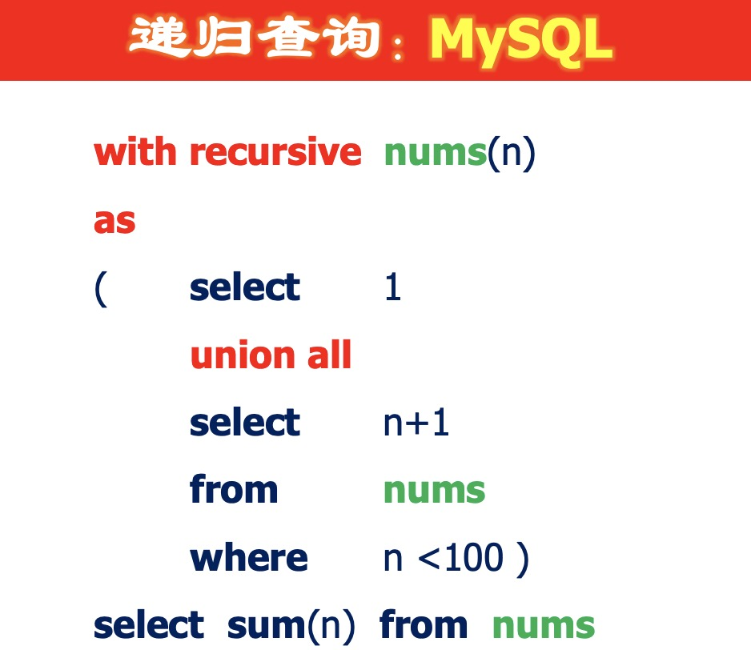
      - 求所有子孙辈节点
        - 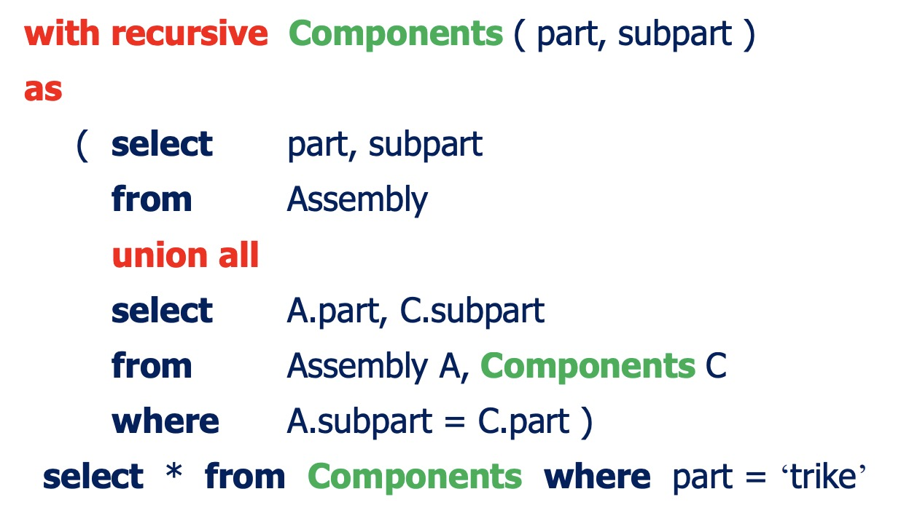
      - 标记层级的查询
        - 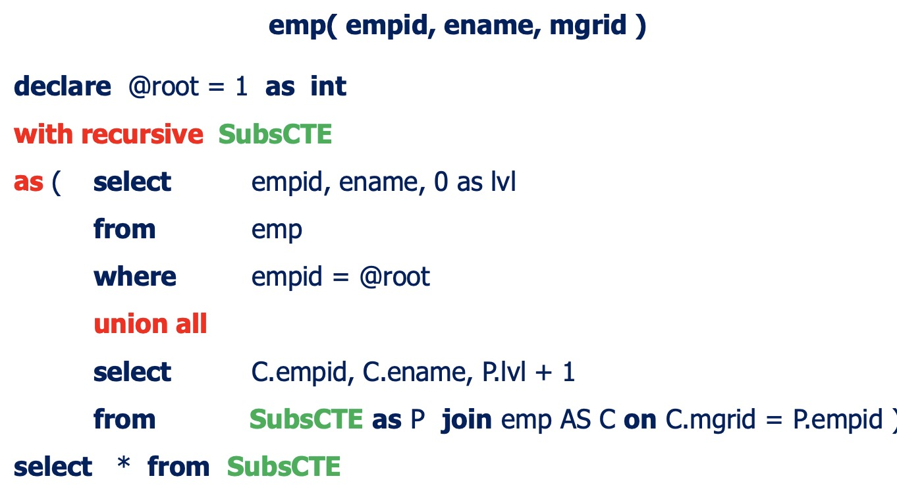
      - 不使用递归语句
        - 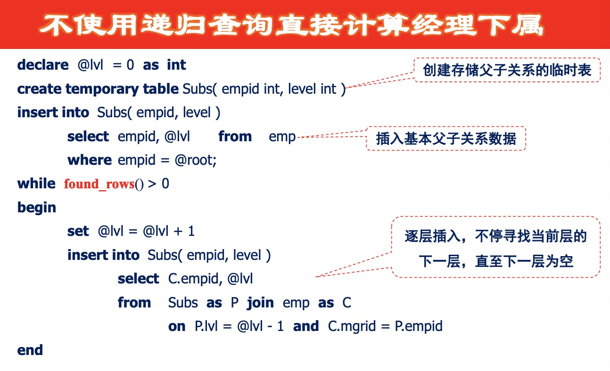
- 失序结构的处理
  - 分析需求：窗口
    - 开一个窗口，统计窗口之内的聚集值
      - 窗口可以滑动，也可以跳动
    - 窗口的定义可以基于时间、行或者值
    - 核心概念：current row: 当前行，基准，之前多少行之后多少行都基于此
    - 自定义累计聚集：求这个条目及以前所有条目的均值
      - 可以用sql直接实现
    - 自定义滑动聚集：窗口位若干天的聚集
      - 可以用sql直接实现
    - 自定义非常啰嗦，可以使用窗口函数
      - `function_name ( <argument>, <argument>,… )over ( <Partition by子句> <Order by子句> <Windowing子句> )`
      - Partition by： 对表进行分区
      - Order by： 排序
      - Windowing： 窗口函数
      - 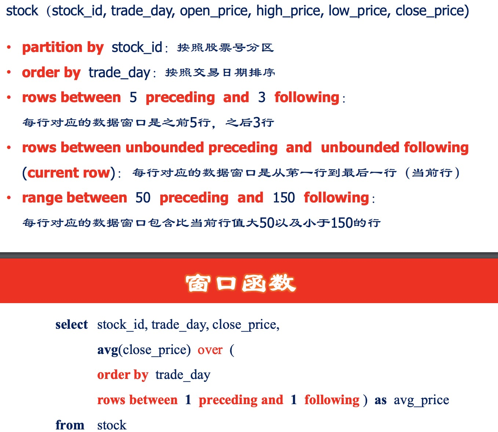
    - 排名函数
      - select XX() over(order by XX desc) ...
        - 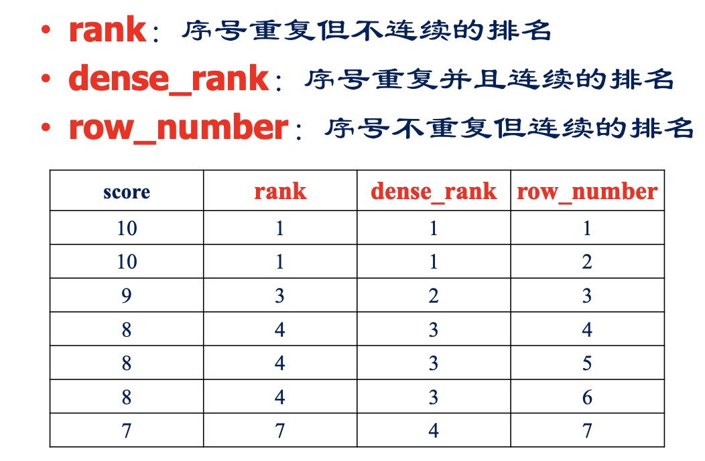
      - Ntile: 希望同等级的人物尽量相差不大
        - ntile(n) over(order by XX desc) ...
      - percent_rank
        - 计算一个值在一组值当中的相对位置或排名
    - 逆分布函数
      - percentile_disc：离散百分位； percentile_cont：连续百分位(可能会取相邻位的均值这样)
    - 偏移函数
      - 取离当前行相隔多少行的数据
        - lag(表达式、偏移量、缺省值) over (…)：将当前行与同一值集中的先前行进行比较
        - lead(表达式、偏移量、缺省值) over (…)：将当前行与同一值集中的后续行进行比较
    - 自定义排名函数没有讲

### 非关系数据模型——XML
- xml为解决什么问题
  - 描述行业规范式的数据共享
    - 部门应用企业内共享：数据库(格式统一)
    - 企业间共享：XML，行业标准的数据规范
  - 描述半结构化的数据
    - 结构化：有统一表头(表结构)的数据，所有数据结构都非常相似
    - 非结构化：文档、视频、音频...，没有任何描述信息
    - 半结构化：没有统一的规范，本身却有一定的结构(网页有标题等)，如果放到一个表里表头会是所有数据等并集导致表非常稀疏
      - 解决：自描述：将描述字段和数据内容绑定地存下
- 定义
  - XGML诞生HTML和XML
  - 把数据的含义描述出来、标签描述、标签可以嵌套
- 术语
  - 标签(tag)：定义数据成为一个元素；文本(text)：说明元素属性
  - 元素(Elements)：<起始标签> 元素属性 <结束标签>的组合
  - 有一定约束，但是上课没细讲
- XML文档产生规则：DTD
  - 描述XML文档的描述文法
  - 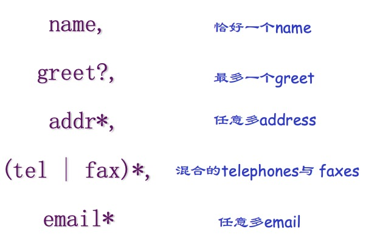
  - 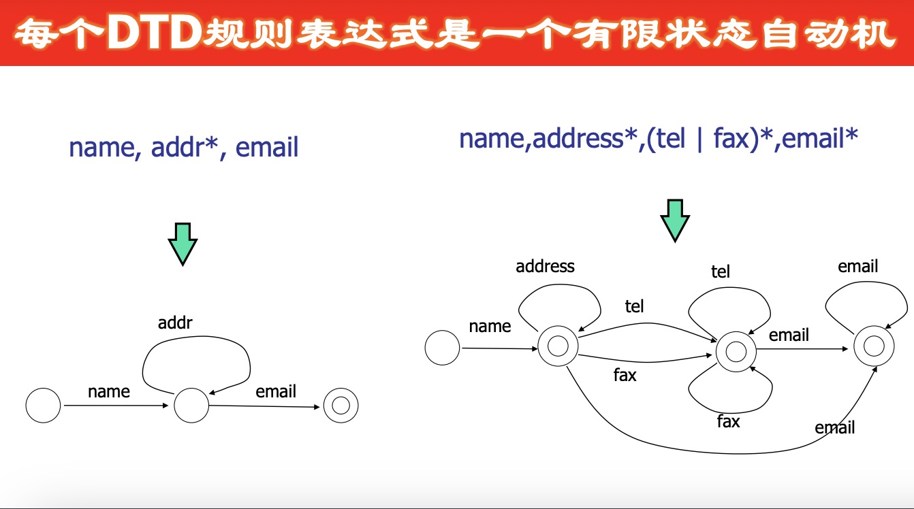
  - 需要有能力检测是否符合某DTD文法
- XML数据模型(DOM)
  - 数据结构呈树型
  - 关于XML的查询是关于树的路径查询
- Xpath：位置路径的类型
  - 关于XML查询的语言
  - 绝对位置路径
    - 由根节点开始，并由斜线(/)和其后位置路径组成
    - /employees/employee
  - 相对位置路径
    - 从当前位置开始，然后是由斜线(/)分割的位置步组成
    - 位置步：坐标轴、节点测试、选取谓词
  - `child::books[Position<6]/decendant::book/attribute::bid`
    - 在当前目录下，前5个books子目录/下层名为book的所有子目录/有bid属性的
  - 节点名称测试
    - child::*，选取所有子节点
    - child::price，选取price子节点
  - 节点类型测试
    - node()，所有类型节点
    - text()，节点内容
    - comment()，注释
  - 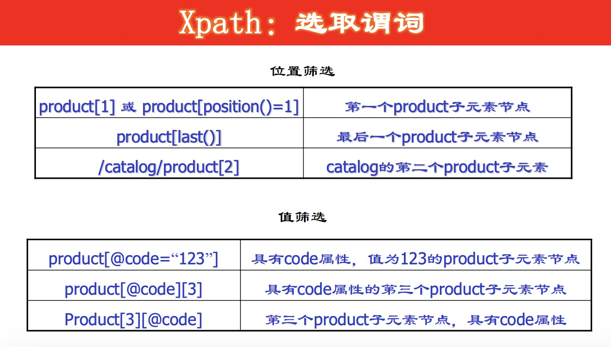
  - /bib//first-name：双斜杠表示查的是后代节点
- XPath ：导航轴
  - 可以查询自己 / 儿子 / 后代 / 父亲 / 祖先...
  - child::author/child:lastname = author/lastname
  - child::author/descendant::zip = author//zip
- Mysql的XML函数
  - update
  - extractvalue
  - 函数功能太弱了，基本很难管理

### 非关系数据模型—JSON
- 为什么互联网不用XML？
  - 太重：把关系表里的数据导成XML产生大量的标签数据，会损耗很大的性能
- 改成使用json
- mysql提供了丰富的json功能
- 定义
  - json的描述手段只有对象和数组
    - 对象：花括号里一堆键值对
    - 数组：值的有序集合
    - 对象和数组可以相互嵌套 / 自嵌套
- MySQL中生成JSON的函数
  - json_array ( val [, val ]… )将值列表返回为JSON数组
  - json_object ( key, val [, key, val ]… )将键值对列表返回为JSON对象
  - 可以嵌套调用
  - 指定JSON可读显示格式： json_pretty(显示格式分段更方便)
  - 可以声明变量为json: a json
    - 数组取值:a->"\$[3]", b->"\$[4][1]"
    - 对象取值:\$.XX.XX
  - 可以把json里的值单拉出来(generated always as)成新的一列建索引
  - 检索json数据是否合法： json\_schema\_valid
    - 提供"minimum", "maximum"
  - 检索操作：
    - json\_extract ( json_doc, path[, path] ... )
    - 可以写[*]表示所有子元素
    - json\_search ( json_doc, one_or_all, search_str )
      - 'one'：只返回一个，'all'：返回所有
      - 返回路径
    - 其他的检索、更新操作只过了一下
    - 将json展开为平面表
      - json_table( expr, path columns (column_list) )
      - 后一部分需要对每个子段做出说明
      - 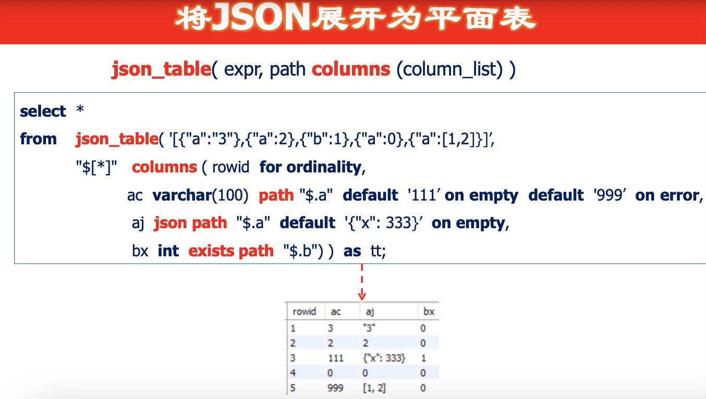
    - 把嵌套在数组里的值展开成原子值
      - 数组里的每个元素都会和其他的元素匹配成一行出现
      - 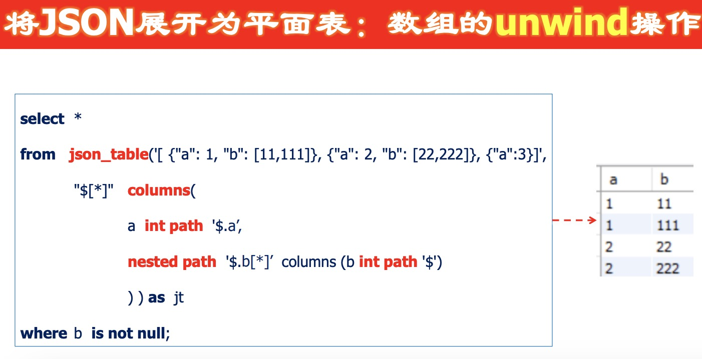
    - 将平面表转为JSON
      - group\_concat：拼在一起
      - concat：加上中括号
      - json\_object：生成json
      - 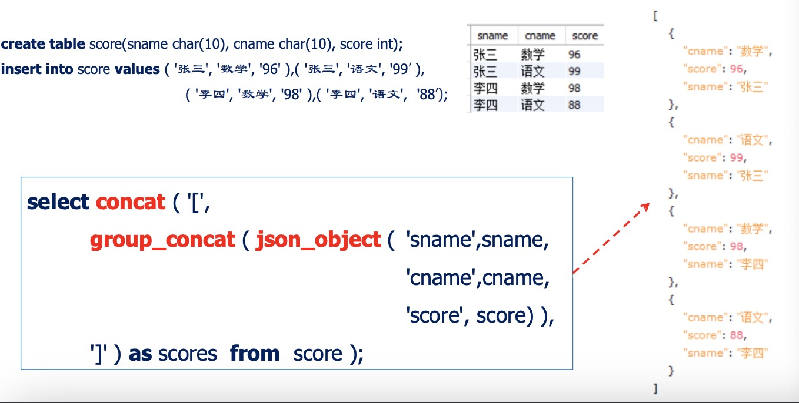

### 关系规范化
- 面向的问题：
  - 不良的模式设计可能产生异常：开发人员开发应用容易陷入怪圈，影响了应用逻辑的开发
  - 存在的问题：不良的数据依赖，通过部分函数依赖、传递函数依赖、多值依赖表示出来
  - 评价关系模式的好坏：根据数据依赖程度，范式级别
  - 范式判定(处于哪个范式级别)：Armstrong公理、属性集的闭包、函数依赖的推导、候选码的计算、函数依赖集的等价和最小覆盖
  - 达不到要求的关系模式的改进：模式分解
  - 最终得到良好的模式设计，进入应用开发阶段
- 关系模式的设计问题
  - 职工-级别-工资表，工资依赖于级别
  - 职工为主码的表里，职工离职，在表里删掉，对应的级别和工资也被删掉了，可能查不到该级别员工应有的工资
  - 不合理，因为查级别对应的工资应该和员工表分开
  - 这里主码是职工，职工不存在后面的都不存在，而工资依赖于级别，这是表结构设计不当构成的——和现实不符的依赖关系
- 异常类别
  - 信息不可表示的问题
    - 插入异常：如果没有职工具有8级工资，则8级工资的工资数额就难以插入
    - 删除异常：如果仅有职工赵明具有4级工资，删除赵明则会将有关4级工资的工资数额信息也一并删除
  - 信息的冗余问题
    - 数据冗余：职工很多，工资级别有限，每一级别的工资数额反复存储多次
    - 更新异常：如果将5级工资的工资数额调为620，则需要找到每个具有5级工资的职工，逐一修改
  - 解决方法：分解：分成 职工-级别 + 级别-工资
  - 不好的“传递的依赖”
- 关系模式的设计问题2
  - 姓名-年龄-性别-爱好表
  - 多爱好，重复多行，需要按姓名+爱好作主码
  - 问题1:数据冗余
  - 问题2:没有兴趣的人不能被插入，因为主码中有空值
  - 不该有的依赖：年龄 / 性别 只依赖于姓名，而不依赖于爱好
  - 不好的“对码的部分依赖”
- 两种有害的依赖关系
  - 对码的传递依赖
  - 对码的部分依赖

#### 函数依赖
- A定了B也确定下来
- 函数依赖的定义
  - 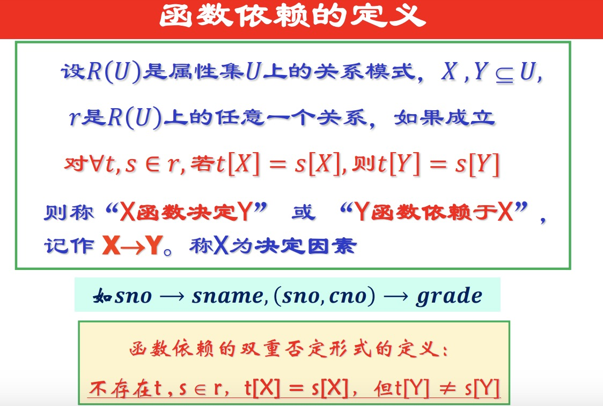
- 函数依赖的级别
  - 针对关系实例检查，满足依赖的关系，实例级别
  - 关系模式中定义出的依赖：模式级别
- 平凡的函数依赖：
  - 如果X → Y，Y $\subseteq$ X，则称其为平凡的函数依赖，否则称为非平凡的函数依赖
  - 如 𝐬𝐧𝐨, 𝒔𝒏𝒂𝒎𝒆 → 𝐬𝐧𝐚𝐦𝐞是平凡的函数依赖
  - 全码
    - 如果R(U)的候选码是整个属性集U，这称为全码
    - 一个全码的关系模式不存在非平凡的函数依赖
- 部分函数依赖
  - 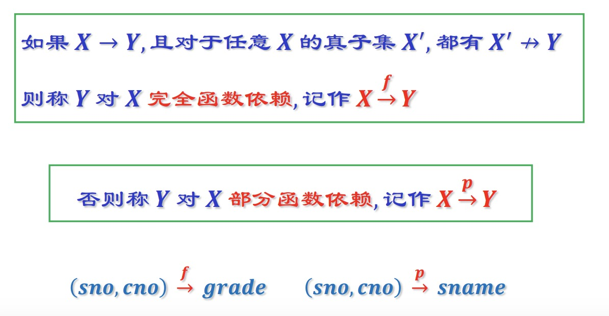
- 传递函数依赖
  - 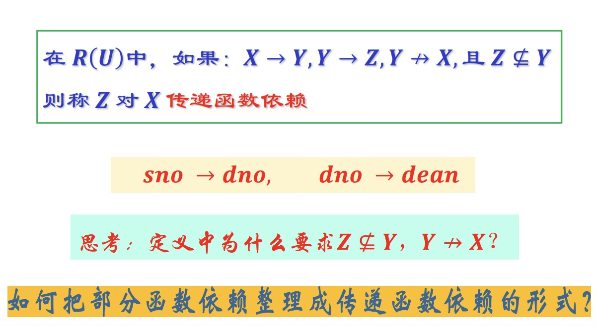
  - 为什么要求Z不包含于Y？
    - 希望定义有害的传递依赖
    - $Z\subseteq Y$导出的X->Z是无害的
  - 为什么不能Y->X？
    - 希望说明对候选码的传递依赖是有害的
    - Y->X则可能对应两个码，多个候选码是被允许的
- 为什么要定义这两种特殊的依赖？
  - 学号->(系号)->系主任
    - 现实当中不存在，设计不当人为产生的，和现实相违背
  - 学号，课程号，姓名，成绩
    - (学好，课程号)->姓名，依赖关系与现实不符
  - 如果存在对候选码的部分依赖和传递依赖必然是现实当中不存在的，需要消除掉
- 一个属性最佳的容身之地应该是在决定它的属性作为主码的表里
- 有部分依赖必然有传递依赖
  - X->Y, $X'\subset Y$, X'->Y
  - X->X', X'->Y
    - X'不能决定X(X是候选码，X'是真子集)
- 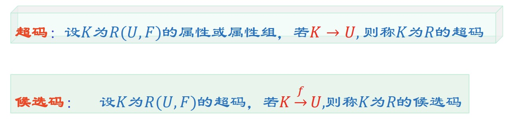
- 主属性：包含在任意候选码中的属性
- 全码：关系模式的码由整个属性组构成，如SPJ

#### 范式
- 范式是对关系的不同数据依赖程度的要求
- 通常是由排除法定义的
- 低级范式包含高级范式
- 范式级别越低，表越混杂
  - 通过模式分解将一个低级范式转换为若干个高级范式的过程称作规范化（概念的纯粹化）
- 第一范式1NF
  - 关系中每一分量不可再分
    - 也即不能以集合、序列等作为属性值
  - 保证每个属性都可以从此方便地查询
    - 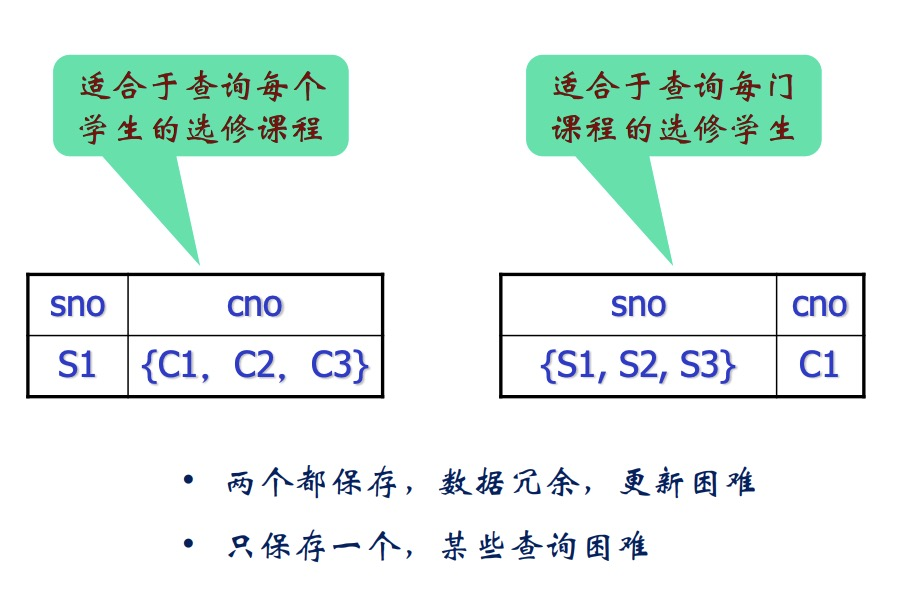
  - 1NF与应用对属性粒度的处理需求
    - 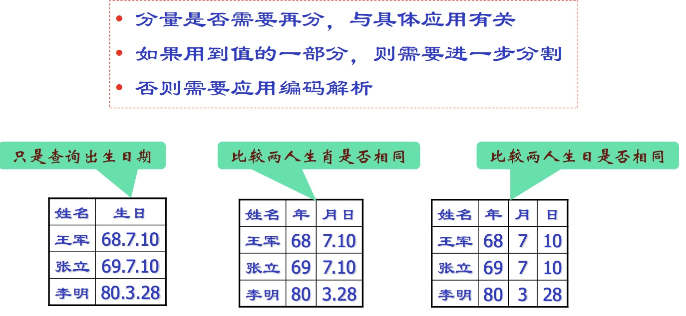
    - 粒度不对需要应用程序写逻辑，违背了数据库的设计原则
  - 1NF与数据质量的控制准则
    - 较细的原子粒度有助于标准化，施加约束避免输入错误，从而提高数据质量（胡乱输入信息很糟糕）
- 第二范式2NF
  - 候选码可能存在部分函数依赖
  - 2NF消除非主属性对码的部分依赖
  - 若𝑅 ∈ 1𝑁𝐹，且每个非主属性完全依赖于码则称 𝑅 ∈ 2𝑁𝐹
  - 如何将关系模式改进到2NF？
    - 非主属性有两种，一种完全依赖于码，一种部分依赖于码，据此将属性集划分为两部分
- 第三范式3NF
  - 传递依赖
  - 3𝑁𝐹的目标是消除非主属性对码的传递依赖
  - 关系模式 𝑅 (𝑈, 𝐹) 中,若不存在这样的码 𝑋,属性组 𝑌 及非主属性 𝑍 (𝑍 ⊈ 𝑌) , 使得下式成立：𝑋 → 𝑌, 𝑌 → 𝑍, 𝑌 ↛ 𝑋则称 𝑅 ∈ 3𝑁𝐹
  - 如何将关系模式改进到3NF？
    - 砸断函数依赖的传递链
- BCNF
  - 一个全是主属性的关系模式一定是3NF
  - 主属性间可能有传递依赖
  - 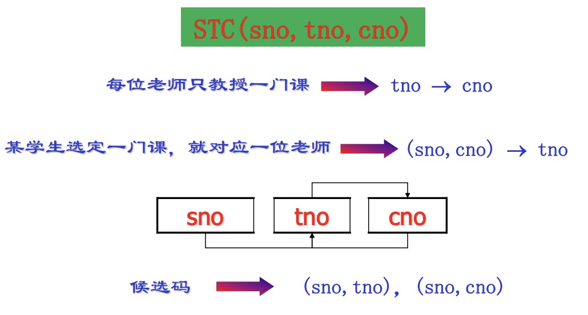
  - 全是主属性，虽然cno只依赖于tno
    - $STC\in 3NF$
    - cno，tno的对子反复出现
    - 希望记录某不开课老师以往的开课信息，不得不保留(NULL, t4, c1)，然而该授课信息无法表达
  - 根源：cno只依赖于tno
  - 主属性对候选码有部分依赖仍会有问题
  - 关系模式 𝑅 𝑈, 𝐹 中,对于属性组 𝑋, 𝑌,若 𝑋 ⟶ 𝑌 𝑌 ⊈ 𝑋 ,那么 𝑋 必是码则 𝑅 ∈ 𝐵𝐶𝑁𝐹
  - BCNF：所有属性都由码直接决定
  - 𝑆𝑇𝐶 ∉ 𝐵𝐶𝑁𝐹，因为𝑡𝑛𝑜 ⟶ 𝑐𝑛𝑜, 但𝑡𝑛𝑜不是码
  - 如何将关系模式改造成BCNF的？
    - X->Y，X不是码，扔到单独的关系模式(X, Y)中
  - 为什么有时会需要3NF而非BCNF的模式设计？
    - 3NF: STC(sno, tno, cno)
    - BCNF: ST(sno, tno), TC(tno, cno)
      - 查询学生选课信息上面即可以完成
      - BCNF可能导致表切的特别细碎，稍微复杂的查询就会导致开销比较大的链接操作
      - 原来的(son, con)->tno丢失了，BCNF不保持函数依赖
        - 某些业务规则无法保存
  - 全码关系里不会有非平凡的函数依赖，因而一定是BCNF的
- 3NF的另外一种定义
  - 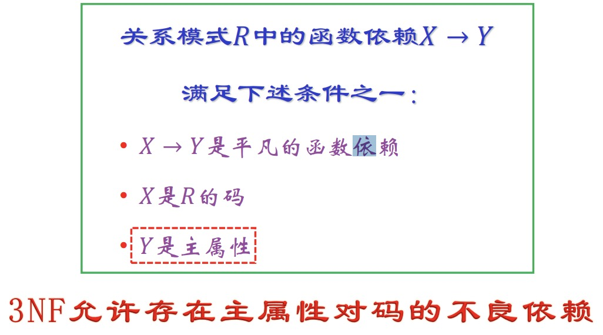
    - 在BCNF的基础上放弃了对右边主属性的限制

#### 多值依赖
- BCNF的关系模式的异常
  - 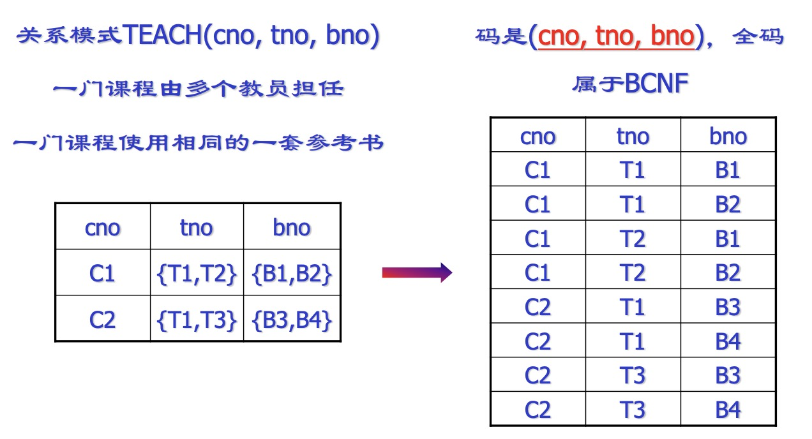
  - 全码，BCNF
  - 不能够插入没有参考书的课程
  - 信息冗余
  - 冗余的根源
    - 1NF展开，如果多列是列表，则每个列表插入都将导致很多额外的行
    - 更简练的表示：丢弃任课老师-参考书的关系就可以存下一门课程所有的老师和参考书
      - 违反了现实，教师和参考书可能变成取值相关的（所有对列出来就是取值无关的）
    - 对等原则
      - $bon_{C_1, T_1} = bon_{C_2, T_2}$
      - 同一门课程不同任课老师的参考书集合是相同的
      - 实现需要产生很多行
  - 多值依赖的描述型定义
    - 描述“彼此取值无关”
    - 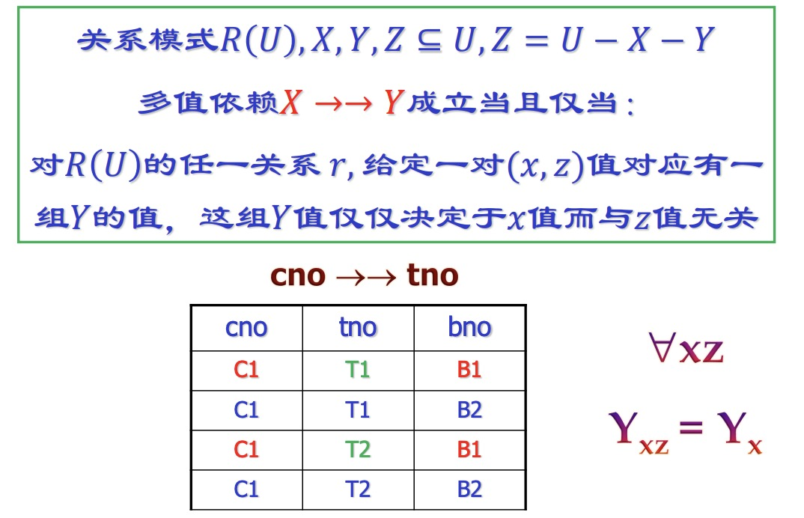
  - 多值依赖的形式化定义
    - 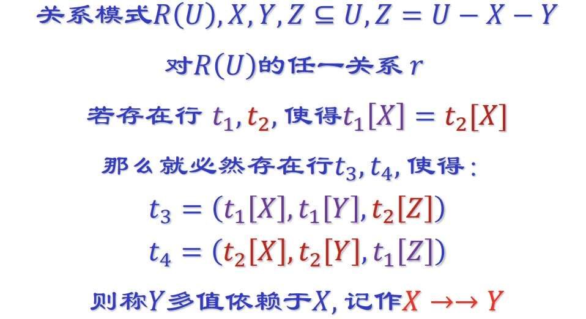
  - 残缺，给出多值依赖，可以相应地生成有需求的表，就不需要冗余的数据了
- 多值依赖的基本性质
  - 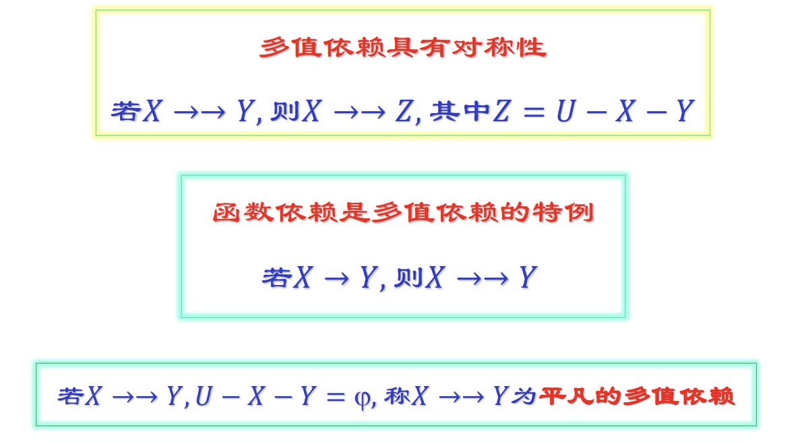