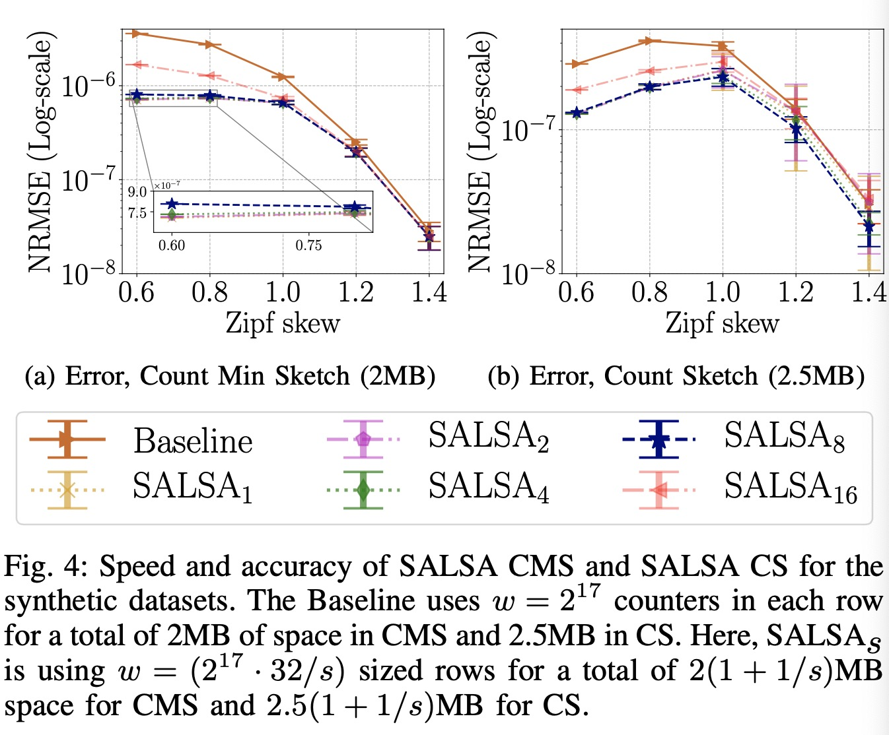

### Background
- Sketches offer tradeoffs between update **speed, accuracy, and space**
  - software-based: update speed
  - hardware-based: space
- Some sketches optimize the update speed at the expense of space.
  - Randomized Counter Sharing: uses multiple hash functions but only updates a random one. 
  - NitroSketch: only performs updates for sampled packets using a novel sampling technique that asymptotically improves over uniform sampling.
    - 具体来说，是隔一段时间在counter中增加一次跟隔离时间反相关大小的值
- Other solutions aim to maximize the accuracy for a given space allocation.
  - Counter Braids and Counter Tree aim to fit into the fast static RAM (SRAM) while optimizing the precision.
    - Using complex offline procedures
    - May be too slow for online applications.
- ABC and Pyramid Sketch vary the size of counters on the fly.
  - ABC: An overflowing counter is allowed to “borrow” bits from the next counter. If there are not enough bits to represent both values, the counters “combine” to create a larger counter.
    - The encoding of ABC is cumbersome. 
      - It requires three bits to mark combined counters and slows the sketch down significantly. 
    - It does not allow counters to combine more than once.
  - Pyramid Sketch: It has several layers for extending overflowing counters. An overflowing counter increases a counter at the next layer. Each pair of same-layer counters are associated with a single counter at the next layer. If both overflow, they will share their most significant bits in that counter while keeping the least significant bits separately.
    - The counters are pre-allocated regardless of the access patterns. 
      - Inferior memory utilization (since many of the upper layers’ counters may never be used).
      - 受限的、不基于输入流量的分配方式
    - Multiple non-sequential memory accesses,
      - Slowing the processing down.
- An orthogonal line of works reduces the size of counters by using probabilistic estimators that only increment their value with a certain probability on an update. Such an approach saves space as estimators can represent large numbers with fewer bits, at the cost of a higher error.

### SALSA
- Contributions
  - 希望从counter的bit长度入手，以在一种
    - 不耗费多余空间
    - 不使用复杂的更新结构(避免降低更新速度，增加访存次数以提高更新速度)
    - 基于输入流的动态分配空间
  - 的方式提高测量精度。
  - A common approach for sketch design is to consider counters as the basic building block.
    - These works do not discuss how many bits each counter should have.
      - depends on the workload and optimization metric.
    - For fixed-size counters, if they are too large, space is wasted.
    - Conversely, if they are too small, there are risks of overflow.
  - 如果按照常规更新，只试图在现有内存紧张的情况下人为重新调节所有counter的大小(global rescaling operations for all the counters)，就会无法根据输入流动态调整内存，丢失很大的潜力
    - 这些方法在处理$highly-skewed$的流时浪费尤为明显
  - 如果使用address-calculation coding(to encode a variable length counter array in near-optimal space)则会在更新阶段带来很大的编码开销
  - SALSA allows for dynamic counter sizing by merging overflowing counters with their neighbors, and optimizes for performance by respecting word alignments.
    - without dynamic memory allocations
    - without relying on additional data structures
    - without requiring global rescaling operations for all the counters
- SALSA encoding
  - SALSA starts with small (e.g., 8-bit) counters and merges overflowing ones with their neighbors to represent larger numbers.
    - More counters fit in a given space without limiting the counting range.
  - Each counter i is associated with a merge bit $m_i$
  - An overflowing counter can merge with its left-neighbor or right-neighbor
  - Select the merge direction to maximize byte and word alignment, which improves performance
  - We also make counters grow in powers of two
  - 
  - SALSA可以用一段中的中间bit(向下取整)标识是否这一段被合并了，通过check相关bit可以判断这一段是否被合并了
  - **Reducing the Encoding Overhead**: The cost of this encoding is a single merge bit per counter.
    - We prove that any encoding for SALSA must use at least $\log_2 1.5$ ≈ 0.585 overhead bits per counter and show a somewhat more complex O(1)-time encoding with at most 0.594 overhead bits per counter.
      - For a given memory allocation, this encoding provides improved accuracy as the lower overhead allows fitting more counters, but may be somewhat slower.
  - **Fine-grained Counter Merges**
    - The SALSA encoding we presented above 
      - Doubles the counter size upon an overflow, 
      - May be wasteful when the overflowing counter could benefit from a smaller increase in size.
    - Tango: Counters can be merged into sizes that are arbitrary multiples of s.
    - To compute the counter size and offset in Tango, we scan the number of set bits to the left and right of mj until we hit a zero at both sides.
    - 
    - Notice that at every point in time, the Tango counters are contained in the corresponding SALSA counters. 
      - This allows us to produce an estimate that is at least as accurate as SALSA.
    - We note that Tango poses a tradeoff
      - It allows more accurate sketches
      - It also has slower decoding time
      - It cannot use the efficient encoding of the previous section.
    - EXP: While it is slightly more accurate, the gains seem marginal considering the computationally expensive operations of determining the counter’s size and offset.
  - Integrates with existing sketches
    - 
    - 两个counter合并时可选的使用数值加和的合并方式(譬如对CS)或者取最大值的合并方式
- Sketch的理论
  - CM、CU可以给出误差期望的上届，通过马尔可夫不等式将期望转成$(\epsilon, \delta)\ guarantee$
  - CS通过分配符号unbiase噪音，通过取中位数的方法去偏，可以给出误差方差的上界进而用切诺夫界bound住$(\epsilon, \delta)\ guarantee$
- SALSA的理论
  - CM / CU: 对于流$f_x$的估值$\hat{f_x}, f_x\leq \hat f_x^{Tango}\leq \hat f_x^{SALSA}\leq \hat f_x^{CM} / \hat f_x^{CU}$，因而至少不差于CM的结果
  - CS / UnivMon(UnivMon中每个子sketch都是CS): 
    - 无偏性：对$f_x$的估值可以由$A = Counter_{hash(x)}$及与其合并的相邻counter决定，每个其他的counter在被合并的条件下值为i的概率与为-i的概率相当，A的无偏性同CS理论可得，因而估值无偏
    - 方差更小：由于对每行$\hat{f_x^{SALSA}}$可以由A的值与相邻counter的值成是否合并的条件变量决定，故而可以直接将方差作差，其结果是其余counter的值的平方的系数为负的线性组合，因而方差会不增，甚至很大概率会更小。
    - 在上面的条件下，使用同CS的分析可以得到相同的$(\epsilon, \delta)\ guarantee$，并且因为方差大概率变小，所以可以期望性能大概率会更优。
- SALSA也可以通过合并完成一般sketch的诸如求流的交和差之类的功能
- AEE采用了以概率p的方式采样流量的技术，如果现有内存相对于目前的流量过小，那么可以把p减半，并且把目前的记录值全部除2或者以1/2的概率采样，SALSA在文中声称同样也可以按这种方式替代merge，具体判断是否应该downsampling是通过计算理论误差比较哪个更小决定的
  - 如果downsampling出来的结果不需要现在这么大的counter，就可以把它分为两个counter每边都存下采样出来的值

### Evaluation
- SALSA的单位counter大小最好为8bit
  - $NRMSE = \frac{\sqrt{MSE}}{n}$
  - 
- 如果CM中的更新可以为负数，那么max-merge要略微优于sum-merge
  - 
- Tango带来的精度增益并不高，相对于它延缓的时间来说
  - 
- SALSA + CM 对比 只用小的counter的CM(只更新未满的位)
  - $\phi$是heavy-hitter的比例
  - 
- 多方位对比：
  - (a)(b): SALSA、Pyramid Sketch的速度只会比baseline(CM)降低20%，ABC由于复杂的编码技术会降低75%
  - (c)(d): SALSA的误差最低(NRMSE)
  - (e)(f)(g)(h): SALSA在低内存时不如ABC，但是在高内存时优于ABC，重要的是它的速度更快
    - The on-arrival NRMSE metric gives more weight to the frequent elements, and is more sensitive to larger errors than AAE and ARE.
    - 
    - both ABC and Pyramid Sketch have elements with high estimations errors(Pyramid方差太大而ABC在高frequency的流处不友善), making them less attractive for (Mean Square Error)-like metrics.
    - 
- SALSA CMS is substantially more accurate (roughly requiring half the space for the same error) than the Baseline(CM & CU)
  - 
- We evaluate SALSA for Count Sketch, SALSA offers statistically significant improvement for the NY18, CH16, and YouTube datasets
  - 